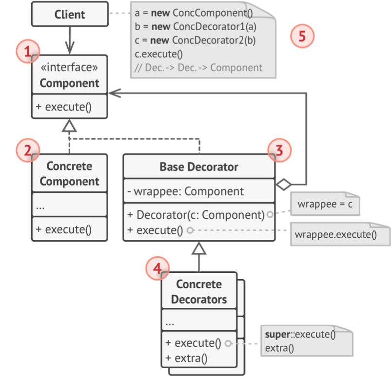
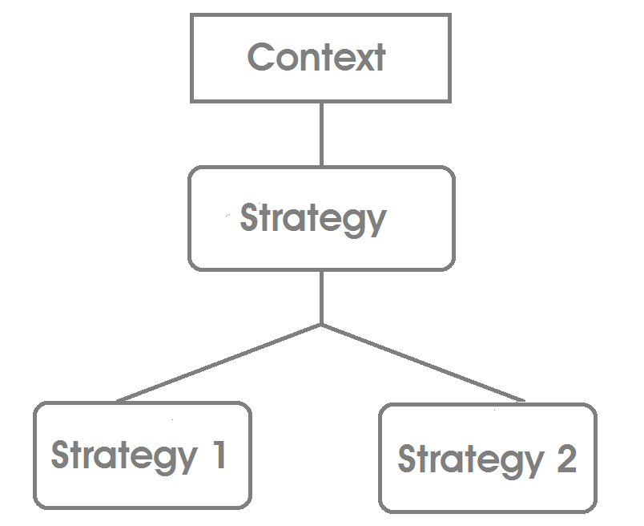

# Head First Design Patterns

[[toc]]

[toc]

> Notes on Eric Freeman' and Elisabeth Robson' "Head First Design Patterns". But with Javascript examples, and additional notes from other sources.

---

Design patterns are typical solutions to commonly occurring problems in software design. They are like pre-made blueprints that you can customize to solve a recurring design problem in your code.

All patterns can be categorized by their _intent_, or purpose.

-   **Creational patterns** provide object creation mechanisms that increase flexibility and reuse of existing code.
-   **Structural patterns** explain how to assemble objects and class- es into larger structures, while keeping the structures flexible and efficient.
-   **Behavioral patterns** take care of effective communication and the assignment of responsibilities between objects.

---

## Creational Design Patterns

Creational patterns provide various object creation mechanisms, which increase flexibility and reuse of existing code.

## The Factory Pattern

### Factory pattern resources

-   [Factory Pattern](https://addyosmani.com/resources/essentialjsdesignpatterns/book/#factorypatternjavascript)

---

## Structural Design Patterns

Structural Design Patterns explain how to assemble objects and classes into larger structures, while keeping these structures flexible and efficient.

### Mixin Pattern

In JavaScript, we can look at inheriting from Mixins as a means of collecting functionality through extension. Each new object we define has a prototype from which it can inherit further properties. Prototypes can inherit from other object prototypes but, even more importantly, can define properties for any number of object instances. We can leverage this fact to promote function re-use.

Mixins allow objects to borrow (or inherit) functionality from them with a minimal amount of complexity. As the pattern works well with JavaScripts object prototypes, it gives us a fairly flexible way to share functionality from not just one Mixin, but effectively many through multiple inheritance.

### Decorator (Wrapper) Pattern

Decorator is a structural design pattern that lets you attach new behaviors to objects by placing these objects inside special wrapper objects that contain the behaviors. **The wrapper contains the same set of methods as the target and delegates to it all requests it receives.** However, the wrap- per may alter the result by doing something either before or after it passes the request to the target.

> Classically, Decorators offered the ability to add behavior to existing classes in a system dynamically. The idea was that the decoration itself wasn't essential to the base functionality of the class, otherwise it would be baked into the superclass itself.

Some points worth mentioning:

-   **In our designs we should allow behavior to be extended without the need to modify existing code.**
-   Decorators have the same super-type as the objects they decorate.
-   You can use one or more decorators to wrap an object.
-   The decorator adds its own behavior either before and/or after delegating to the object it decorates to do the rest of the job.
-   Objects can be decorated at any time, so we can decorate objects dynamically at runtime with as many decorators as we like.
-   Decorators need the same _interface_ as the components they wrap because they need to stand in place of the component. When we compose a decorator with a component, we are adding new behavior. We are acquiring new behavior not by inheriting it from a superclass, but by composing objects together.

> Wearing clothes is an real-life example of using decorators. When you're cold, you wrap yourself in a sweater. If you're still cold with a sweater, you can wear a jacket on top. If it's raining, you can put on a raincoat. All of these garments _extend_ your basic behavior but aren't part of you, and you can easily take off any piece of clothing whenever you don't need it.

#### Decorator Structure



1.  The Component declares the common interface for both wrappers and wrapped objects.
2.  Concrete Component is a class of objects being wrapped. It defines the basic behavior, which can be altered by decorators.
3.  The Base Decorator class has a field for referencing a wrapped object. The field's type should be declared as the component interface so it can contain both concrete components and decorators. The base decorator delegates all operations to the wrapped object.
4.  Concrete Decorators define extra behaviors that can be added to components dynamically. Concrete decorators override methods of the base decorator and execute their behavior either before or after calling the parent method.
5.  The Client can wrap components in multiple layers of decorators, as long as it works with all objects via the component interface.

#### Decorator Pseudocode


The application wraps the data source object with a pair of decorators. Both wrappers change the way the data is written to and read from the disk:

-   Just before the data is written to disk, the decorators encrypt and compress it. The original class writes the encrypted and protected data to the file without knowing about the change.
-   Right after the data is read from disk, it goes through the same decorators, which decompress and decode it.

The decorators and the data source class implement the same interface, which makes them all interchangeable in the client code.

```ts
// The component interface defines operations that can be // altered by decorators.
interface DataSource is
	method writeData(data)
	method readData():data

// Concrete components provide default implementations for the // operations. There might be several variations of these classes in a program.
class FileDataSource implements DataSource is
	constructor FileDataSource(filename) { ... }

	method writeData(data) is
		// Write data to file.
	method readData():data is
		// Read data from file.

// The base decorator class follows the same interface as the // other components. The primary purpose of this class is to define the wrapping interface for all concrete decorators.
// The default implementation of the wrapping code might include // a field for storing a wrapped component and the means to initialize it.

class DataSourceDecorator implements DataSource is
	protected field wrappee: DataSource

	constructor DataSourceDecorator(source: DataSource) is
		wrappee = source

	// The base decorator simply delegates all work to the // wrapped component. Extra behaviors can be added in concrete decorators.
	method writeData(data) is
		wrappee.writeData(data)

	// Concrete decorators may call the parent implementation of the operation instead of calling the wrapped object directly. This approach simplifies extension of decorator classes.
	method readData():data is
		return wrappee.readData()

// Concrete decorators must call methods on the wrapped object, but may add something of their own to the result. Decorators can execute the added behavior either before or after the call to a wrapped object.
class EncryptionDecorator extends DataSourceDecorator is
	method writeData(data) is
		// 1. Encrypt passed data.
		// 2. Pass encrypted data to the wrappee's writeData method.
	method readData():data is
		// 1. Get data from the wrappee's readData method.
		// 2. Try to decrypt it if it's encrypted.
		// 3. Return the result.

// You can wrap objects in several layers of decorators.
class CompressionDecorator extends DataSourceDecorator is
	method writeData(data) is
		// 1. Compress passed data.
		// 2. Pass compressed data to the wrappee's writeData method.

	method readData():data is
		// 1. Get data from the wrappee's readData method.
		// 2. Try to decompress it if it's compressed.
		// 3. Return the result.

// A simple example of a decorator assembly.
class Application is
	method dumbUsageExample() is
		source = new FileDataSource("somefile.dat")
		source.writeData(salaryRecords)
		// The target file has been written with plain data.

		source = new CompressionDecorator(source)
		source.writeData(salaryRecords)
		// The target file has been written with compressed data.

		source = new EncryptionDecorator(source)
		// The source variable now contains this: Encryption > Compression > FileDataSource
		source.writeData(salaryRecords)
		// The file has been written with compressed and encrypted data.
```

#### When to Use the Decorator Pattern

The decorator pattern should be used when you want to add features to an object without having to change the code that uses it. Since decorators can modify objects dynamically and transparently, they are perfect for modifying existing systems. It can often be easier to create and apply a few decorators than it is to go through the trouble of creating and maintaining a subclass.

-   Use the Decorator pattern when you need to be able to assign extra behaviors to objects at runtime without breaking the code that uses these objects.
-   Use the pattern when it's awkward or not possible to extend an object's behavior using inheritance.
-   If you want to follow _Single Responsibility Principle_. You can divide a monolithic class that implements many possible variants of behavior into several smaller classes.

Take care of these drawbacks:

-   It can be hard to remove a specific wrapper from the wrappers stack.
-   It's hard to implement a decorator in such a way that its behavior doesn't depend on the order in the decorators stack.
-   If poorly managed, it can significantly complicate our application architecture as it introduces many small, but similar objects into our namespace. The concern here is that in addition to becoming hard to manage, other developers unfamiliar with the pattern may have a hard time grasping why it's being used.

#### Decorator Examples

Adding new attributes to objects in JavaScript is a very straight-forward process so with this in mind, a very simplistic decorator may be implemented as follows:

```js
// A vehicle constructor
function Vehicle(vehicleType) {
	// some sane defaults
	this.vehicleType = vehicleType || 'car';
	this.model = 'default';
	this.license = '00000-000';
}
// Test instance for a basic vehicle
var testInstance = new Vehicle('car');
console.log(testInstance);
// Outputs: vehicle: car, model: default, license: 00000-000

// Lets create a new instance of vehicle, to be decorated
var truck = new Vehicle('truck');

// New functionality we're decorating vehicle with
truck.setModel = function (modelName) {
	this.model = modelName;
};
truck.setColor = function (color) {
	this.color = color;
};
// Test the value setters and value assignment works correctly
truck.setModel('CAT');
truck.setColor('blue');

console.log(truck);
// Outputs: vehicle:truck, model:CAT, color: blue

// Demonstrate "vehicle" is still unaltered
var secondInstance = new Vehicle('car');
console.log(secondInstance);
// Outputs: vehicle: car, model: default, license: 00000-000
```

```js
/* MethodProfiler class. */
var MethodProfiler = function (component) {
	this.component = component;
	this.timers = {};

	for (let key in this.component) {
		// Ensure that the property is a function.
		if (typeof this.component[key] !== 'function') {
			continue;
		}
		// Add the method.
		let that = this;
		(function (methodName) {
			that[methodName] = function () {
				that.startTimer(methodName);
				const returnValue = that.component[methodName].apply(that.component, arguments);
				that.displayTime(methodName, that.getElapsedTime(methodName));
				return returnValue;
			};
		})(key);
	}
};
MethodProfiler.prototype = {
	startTimer: function (methodName) {
		this.timers[methodName] = new Date().getTime();
	},
	getElapsedTime: function (methodName) {
		return new Date().getTime() - this.timers[methodName];
	},
	displayTime: function (methodName, time) {
		console.log(methodName + ': ' + time + ' ms');
	},
};

var list = new ListBuilder('list-container', 5000);
list = new MethodProfiler(list);
list.buildList('ol'); // Displays "buildList: 301 ms".
list.buildList('ul'); // Displays "buildList: 287 ms".
list.removeLists('ul'); // Displays "removeLists: 10 ms".
list.removeLists('ol'); // Displays "removeLists: 12 ms".
```

#### Pseudo-classical Decorators

There is a variation of the Decorator first presented in a JavaScript form in [Pro JavaScript Design Patterns by Dustin Diaz and Ross Harmes](https://www.amazon.com/Pro-JavaScript-Design-Patterns-Object-Oriented/dp/159059908X). Unlike the examples we can usually come across, Diaz and Harmes stick more closely to how decorators are implemented in other programming languages (such as Java or C++) using the concept of an _"interface"_.

> This particular variation of the Decorator pattern is provided for reference purposes. If finding it overly complex, I recommend opting for one of the simpler implementations covered earlier.

The book describes the Decorator as a pattern that is used to transparently wrap objects inside other objects of the same interface. An interface is a way of defining the methods an object should have, however, it doesn't actually directly specify how those methods should be implemented.

> They can also indicate what parameters the methods take, but this is considered optional.

_So, why would we use an interface in JavaScript?_ The idea is that they're self-documenting and promote reusability. In theory, interfaces also make code more stable by ensuring changes to them must also be made to the objects implementing them. Below is an example of an implementation of interfaces in JavaScript using duck-typing - an approach that helps determine whether an object is an instance of constructor/object based on the methods it implements.

```ts
// Create interfaces using a pre-defined Interface constructor that accepts an interface name and skeleton methods to expose.

// In our reminder example summary() and placeOrder() represent functionality the interface should support
var reminder = new Interface('List', ['summary', 'placeOrder']);

var properties = {
	name: 'Remember to buy the milk',
	date: '05/06/2016',
	actions: {
		summary: function () {
			return 'Remember to buy the milk, we are almost out!';
		},
		placeOrder: function () {
			return 'Ordering milk from your local grocery store';
		},
	},
};

// Now create a constructor implementing the above properties and methods
function Todo(config) {
	// State the methods we expect to be supported as well as the Interface instance being checked against
	Interface.ensureImplements(config.actions, reminder);

	this.name = config.name;
	this.methods = config.actions;
}

// Create a new instance of our Todo constructor
var todoItem = new Todo(properties);

// Finally test to make sure these function correctly
console.log(todoItem.methods.summary());
console.log(todoItem.methods.placeOrder());
// Outputs:
// Remember to buy the milk, we are almost out!
// Ordering milk from your local grocery store
```

In the above, `Interface.ensureImplements` provides strict functionality checking and code for both this and the `Interface` constructor can be found here.

But, the biggest problem with interfaces is that, as there isn't built-in support for them in JavaScript, there is a danger of us attempting to emulate a feature of another language that may not be an ideal fit.

A functional example of this approach example can be found [here](https://jsbin.com/UMEJaXu/1/edit?html,js,output).

#### The Decorator Pattern vs. the Composition Pattern

I've mixed up decorator with Composition pattern, more times that I would want to admit. In the end the simplest explanation about their differences - a Decorator is like a Composite but only has one child component; there's another significant difference: Decorator adds additional responsibilities to the wrapped object, while Composite just "sums up" its children's results.

While a simple composite can be identical to a simple decorator, the difference between the two lies in the focus. Composites do not modify the method calls and instead focus on organizing the sub-objects. Decorators exist solely to modify the method calls and do no organization, since there is only one sub-object.

#### Function Decorators

Decorators need not be limited to just classes. It is possible to create decorators that wrap individual functions and methods as well.

Here is an example of a simple function decorator. It wraps another function and causes the returned results to be uppercased:

```js
function upperCaseDecorator(func) {
	return function () {
		// func.apply is used to execute the wrapped function.
		return func.apply(this, arguments).toUpperCase();
	};
}
```

This decorator can be used to create a new function, which can then be executed normally. In this example, a normal function is defined and then decorated to create a new function:

```js
function getDate() {
	return new Date().toString();
}
var getDateCaps = upperCaseDecorator(getDate);
```

The getDateCaps function can be called like any other function. It will return the results in uppercase:

```ts
console.log(getDate()); // outputs: Sun Jul 26 2020 11:38:00 GMT+0200 (Central European Summer Time)
console.log(getDateCaps()); // outputs: SUN JUL 26 2020 11:38:11 GMT+0200 (CENTRAL EUROPEAN SUMMER TIME)
```

### Facade Pattern

Facade is a structural design pattern that provides a simplified interface to a library, a framework, or any other complex set of classes.

---

## Behavioral Design Patterns

Behavioral Design Patterns are concerned with algorhitms and the assignment of responsibilities between objects. It's aim is to promote code re-use. Similar to Mixins, they can be considered another viable alternative to object sub-classing.

### Strategy Pattern

> also known as the **Policy pattern**.

**The Strategy pattern** suggests that you take a class that does something specific in a lot of different ways and extract all of these algorithms into separate classes called `strategies`. The original class, called `context`, must have a field for storing a reference to one of the strategies. The context delegates the work to a linked strategy object instead of executing it on its own.

The context isn't responsible for selecting an appropriate algorithm for the job. Instead, the client passes the desired strategy to the context. In fact, the context doesn't know much about strategies. It works with all strategies through the same generic interface, which only exposes a single method for triggering the algorithm encapsulated within the selected strategy.

This way the context becomes independent of concrete strategies, so you can add new algorithms or modify existing ones without changing the code of the context or other strategies.

> The strategy pattern is a behavioral design pattern that enables selecting an algorithm at runtime.
>
> -   [Wikipedia](https://en.wikipedia.org/wiki/Strategy_pattern)

The Strategy Pattern has several advantages:

-   It's easy to switch between different algorithms (strategies) in runtime because you're using polymorphism in the interfaces.
-   Clean code because you separate the concerns into classes (a class to each strategy) thus avoid conditional-infested code.

#### When to Use the Strategy Pattern

-   When you need to use several algorithms with different variations. You need create a concrete class to implement your algorithm (which can consist of a or some functions).
-   When there are conditional statements around several related algorithms.
-   When most of your classes have related behaviors.

#### Pseudocode

```ts
// The strategy interface declares operations common to all supported versions of some algorithm.
// The context uses this interface to call the algorithm defined by the concrete strategies.
interface Strategy is
	method execute(a, b)

// Concrete strategies implement the algorithm while following the base strategy interface.
//  The interface makes them interchangeable in the context.
class ConcreteStrategyAdd implements Strategy is
	method execute(a, b)
		is return a + b

class ConcreteStrategySubtract implements Strategy is
	method execute(a, b) is
		return a - b

class ConcreteStrategyMultiply implements Strategy is
	method execute(a, b) is
		return a * b

// The context defines the interface of interest to clients.
class Context is
	// The context maintains a reference to one of the strategy objects.
	// The context doesn't know the concrete class of a strategy.
	// It should work with all strategies via the strategy interface.
	private strategy: Strategy

	// Usually the context accepts a strategy through the constructor,
	// and also provides a setter so that the strategy can be switched at runtime.
	method setStrategy(Strategy strategy) is
		this.strategy = strategy

	// The context delegates some work to the strategy object instead of
	// implementing multiple versions of the algorithm on its own.
	method executeStrategy(int a, int b) is
		return strategy.execute(a, b)

	// The client code picks a concrete strategy and passes it to the context.
	//  The client should be aware of the differences between strategies in order to make the right choice.
	class ExampleApplication is
		method main() is

		Create context object.

		Read first number.
		Read last number.
		Read the desired action from user input.

		if (action == addition) then
			context.setStrategy(new ConcreteStrategyAdd())

		if (action == subtraction) then
			context.setStrategy(new ConcreteStrategySubtract())

		if (action == multiplication) then
			context.setStrategy(new ConcreteStrategyMultiply())

		result = context.executeStrategy(First number, Second number)

		Print result.
```

#### Examples

Strategy Manager:

```js
class StrategyManager {
	constructor() {
		//  represents the strategy used
		this.strategy = null;
	}

	get strategy() {
		return this.strategy;
	}

	set strategy(strategy) {
		this.strategy = strategy;
	}
	// The method doAction will be implemented in each concrete strategy
	doSomething() {
		this.strategy.doSomething();
	}
}

class StrategyA {
	doSomething() {
		console.log('StrategyA implementation');
	}
}

class StrategyB {
	doSomething() {
		console.log('StrategyB implementation');
	}
}

const strategyManager = new StrategyManager();
const strategyA = new StrategyA();
const strategyB = new StrategyB();

strategyManager.strategy = strategyA;
strategyManager.doSomething();

strategyManager.strategy = strategyB;
strategyManager.doSomething();
```

Greeter:

```js
// Greeter is a class of object that can greet people.
// It can learn different ways of greeting people through 'Strategies.'

// This is the Greeter constructor.
const Greeter = function (strategy) {
	this.strategy = strategy;
};

// Greeter provides a greet function that is going to
// greet people using the Strategy passed to the constructor.
Greeter.prototype.greet = function () {
	return this.strategy();
};

// Since a function encapsulates an algorithm, it makes a perfect
// candidate for a Strategy.

// Here are a couple of Strategies to use with our Greeter.
const politeGreetingStrategy = function () {
	console.log('Hello.');
};

const friendlyGreetingStrategy = function () {
	console.log('Hey!');
};

const boredGreetingStrategy = function () {
	console.log('sup.');
};

// Let's use these strategies!
const politeGreeter = new Greeter(politeGreetingStrategy);
const friendlyGreeter = new Greeter(friendlyGreetingStrategy);
const boredGreeter = new Greeter(boredGreetingStrategy);

politeGreeter.greet(); //=> Hello.
friendlyGreeter.greet(); //=> Hey!
boredGreeter.greet(); //=> sup.
```

Sorting Strategy:

```ts
// interface all sorting algorithms must implement
interface SortingStrategy {
	sort(array);
}
// heap sort algorithm implementing the `SortingStrategy` interface, it implements its algorithm in the `sort` method
class HeapSort implements SortingStrategy {
	sort() {
		log('HeapSort algorithm');
	}
}
// linear search sorting algorithm implementing the `SortingStrategy` interface, it implements its algorithm in the `sort` method
class LinearSearch implements SortingStrategy {
	sort(array) {
		log('LinearSearch algorithm');
	}
}
class SortingProgram {
	private sortingStrategy: SortingStrategy;
	constructor(array: Array<Number>) {
		this.array = array;
	}
	runSort(sortingStrategy: SortingStrategy) {
		return this.sortingStrategy.sort(this.array);
	}
}
// instantiate the `SortingProgram` with an array of numbers
const sortProgram = new SortingProgram([9, 2, 5, 3, 8, 4, 1, 8, 0, 3]);
// sort using heap sort
sortProgram.runSort(new HeapSort());
// sort using linear search
sortProgram.runSort(new LinearSearch());
```

Car Wash program:

```ts
// Steve Fenton's example Car Wash program
interface BodyCleaning {
	clean(): void;
}
interface WheelCleaning {
	clean(): void;
}
class BasicBodyCleaningFactory implements BodyCleaning {
	clean() {
		log('Soap Car');
		log('Rinse Car');
	}
}
class ExecutiveBodyCleaningFactory implements BodyCleaning {
	clean() {
		log('Wax Car');
		log('Blow-Dry Car');
	}
}
class BasicWheelCleaningFactory implements BodyCleaning {
	clean() {
		log('Soap Wheel');
		log('Rinse wheel');
	}
}
class ExecutiveWheelCleaningFactory implements BodyCleaning {
	clean() {
		log('Brush Wheel');
		log('Dry Wheel');
	}
}
class CarWash {
	washCar(washLevel: Number) {
		switch (washLevel) {
			case 1:
				new BasicBodyCleaningFactory().clean();
				new BasicWheelCleaningFactory().clean();
				break;
			case 2:
				new BasicBodyCleaningFactory().clean();
				new ExecutiveWheelCleaningFactory().clean();
				break;
			case 3:
				new ExecutiveBodyCleaningFactory().clean();
				new ExecutiveWheelCleaningFactory().clean();
				break;
		}
	}
}
```

---

Looking at examples, it's noticeable that the key idea is to create objects which represent various strategies. These objects form a pool of strategies from which the context object can choose from to vary its behavior as per its strategy. These objects (strategies) perform the same operation, have the same(single) job and compose the same interface strategy.

#### Structure



In the figure above, the `Context` class depends on the `Strategy`. During execution or runtime, different strategies of `Strategy` type are passed to the `Context` class. The Strategy provides the template by which the strategies must abide by for implementation.

#### How to Implement

-   identify an algorithm that's prone to frequent changes. It may also be a massive conditional that selects and executes a variant of the same algorithm at runtime.
-   Declare the strategy interface common to all variants of the algorithm.
-   One by one, extract all algorithms into their own classes. They should all implement the strategy interface.
-   In the context class, add a field for storing a reference to a strategy object. Provide a setter for replacing values of that field. The context should work with the strategy object only via the strategy interface. The context may define an interface which lets the strategy access its data.
-   Clients of the context must associate it with a suitable strategy that matches the way they expect the context to perform its primary job.

#### Strategy pattern resources

-   [The Strategy Pattern - Wikipedia](https://en.wikipedia.org/wiki/Strategy_pattern)

### The Observer Pattern

> _Observer is a behavioral design pattern that lets you define a subscription mechanism to notify multiple objects about any events that happen to the object they're observing. It's also known as the publisher-subscriber pattern._

When you're trying to picture the Observer Pattern, a newspaper subscription service with its publisher and subscribers is a good way to visualize the pattern.

> The Observer Pattern defines a **one-to-many** dependency between objects so that when one object changes state, all of its dependents are notified and updated automatically.

In the observer pattern, there are two roles: the observer and the observed (watch or be watched), or we refer can them as publishers and subscribers.


The subject and observers define the one-to-many relationship. The observers are dependent on the subject such that when the subject's state changes, the observers get notified. Depending on the style of notification, the observer may also be updated with new values.

There are a few different ways to implement the Observer Pattern, but most revolve around a class design that includes **Subject** and **Observer** interfaces.


#### The power of Loose Coupling

> Strive for loosely coupled designs between objects that interact.

When two objects are loosely coupled, they can interact, but have very little knowledge of each other. The Observer Pattern provides an object design where subjects and observers are loosely coupled. Loosely coupled designs allow us to build flexible OO systems that can handle change because they minimize the interdependency between objects.

-   **The only thing the subject knows about an observer is that it implements a certain interface (the Observer interface).** It doesn't need to know the concrete class of the observer, what it does, or anything else about it.
-   _We can add new observers at any time._ Because the only thing the subject depends on is a list of objects that implement the Observer interface, we can add new observers whenever we want. In fact, we can replace any observer at runtime with another observer and the subject will keep purring along. Likewise, we can remove observers at any time.
-   _We never need to modify the subject to add new types of observers._ Let's say we have a new concrete class come along that needs to be an observer. We don't need to make any changes to the subject to accommodate the new class type; all we have to do is implement the Observer interface in the new class and register as an observer. The subject doesn't care; it will deliver notifications to any object that implements the Observer interface.
-   _We can reuse subjects or observers independently of each other._ If we have another use for a subject or an observer, we can easily reuse them because the two aren't tightly coupled.
-   _Changes to either the subject or an observer will not affect the other._ Because the two are loosely coupled, we are free to make changes to either, as long as the objects still meet their obligations to implement the subject or observer interfaces.

#### The Observer Pattern Structure


1. The Publisher (Subject) issues events of interest to other objects (observers). These events occur when the publisher changes its state or executes some behaviors.
2. When a new event happens, the publisher goes over the subscription list and calls the notification method declared in the subscriber interface on each subscriber object.
3. The Subscriber interface declares the notification interface. In most cases, it consists of a single update method.
4. Concrete Subscribers perform some actions in response to notifications issued by the publisher.
5. Usually, subscribers need some contextual information to handle the update correctly. For this reason, publishers often pass some context data as arguments of the notification method. The publisher can pass itself as an argument, letting sub- scriber fetch any required data directly.
6. The Client creates publisher and subscriber objects separately and then registers subscribers for publisher updates.

#### When to use Observer Pattern

-   Use the Observer pattern when changes to the state of one object may require changing other objects, and the actual set of objects is unknown beforehand or changes dynamically.
-   Use the pattern when some objects in your app must observe others, but only for a limited time or in specific cases.

The Observer and Publish/Subscribe patterns encourage us to think hard about the relationships between different parts of our application. They also help us identify what layers containing direct relationships which could instead be replaced with sets of subjects and observers. This effectively could be used to break down an application into smaller, more loosely coupled blocks to improve code management and potentials for re-use.

#### The Observer Pattern Pseudocode

```ts
// The base publisher class includes subscription management // code and notification methods.
class EventManager is
	private field listeners: hash map of event types and listeners

method subscribe(eventType, listener) is
	listeners.add(eventType, listener)

method unsubscribe(eventType, listener) is
	listeners.remove(eventType, listener)

method notify(eventType, data) is
	foreach (listener in listeners.of(eventType)) do
		listener.update(data)

// The concrete publisher contains real business logic that's // interesting for some subscribers. We could derive this class // from the base publisher, but that isn't always possible in // real life because the concrete publisher might already be a // subclass. In this case, you can patch the subscription logic // in with composition, as we did here.
class Editor is
	private field events: EventManager
	private field file: File

	constructor Editor() is
		events = new EventManager()

	// Methods of business logic can notify subscribers about changes.
	method openFile(path) is
		this.file = new File(path) events.notify("open", file.name)

	method saveFile() is
		file.write() events.notify("save", file.name

	// ...

// Here's the subscriber interface. If your programming language // supports functional types, you can replace the whole
// subscriber hierarchy with a set of functions.
interface EventListener is
	method update(filename)

// Concrete subscribers react to updates issued by the publisher // they are attached to.
class LoggingListener implements EventListener is
	private field log: File
	private field message

	constructor LoggingListener(log_filename, message) is
		this.log = new File(log_filename)
		this.message = message

		method update(filename) is
			log.write(replace('%s',filename,message))

class EmailAlertsListener implements EventListener is
private field email: string
constructor EmailAlertsListener(email, message) is
	this.email = email
	this.message = message

	method update(filename) is
		system.email(email, replace('%s',filename,message))

// An application can configure publishers and subscribers at // runtime.
class Application is
	method config() is
		editor = new TextEditor()

		logger = new LoggingListener( "/path/to/log.txt", "Someone has opened the file: %s");
		editor.events.subscribe("open", logger)

		emailAlerts = new EmailAlertsListener( "admin@example.com", "Someone has changed the file: %s")
		editor.events.subscribe("save", emailAlerts)
```

### Observer Pattern Examples

```ts
// Observers
function ObserverList() {
	this.observerList = [];
}
ObserverList.prototype.add = function (obj) {
	return this.observerList.push(obj);
};
ObserverList.prototype.count = function () {
	return this.observerList.length;
};
ObserverList.prototype.get = function (index) {
	if (index > -1 && index < this.observerList.length) {
		return this.observerList[index];
	}
};
ObserverList.prototype.indexOf = function (obj, startIndex) {
	var i = startIndex;

	while (i < this.observerList.length) {
		if (this.observerList[i] === obj) {
			return i;
		}
		i++;
	}
	return -1;
};
ObserverList.prototype.removeAt = function (index) {
	this.observerList.splice(index, 1);
};

// Subject
function Subject() {
	this.observers = new ObserverList();
}
Subject.prototype.addObserver = function (observer) {
	this.observers.add(observer);
};
Subject.prototype.removeObserver = function (observer) {
	this.observers.removeAt(this.observers.indexOf(observer, 0));
};
Subject.prototype.notify = function (context) {
	var observerCount = this.observers.count();
	for (var i = 0; i < observerCount; i++) {
		this.observers.get(i).update(context);
	}
};
```

```ts
function Publisher() {
	this.subscribers = [];
}
Publisher.prototype.deliver = function (data) {
	this.subscribers.forEach(function (fn) {
		fn(data);
	});
	return this;
};

// With this piece of code, the Function object prototype is extended, which gives all func- tions loaded into memory the ability to call a subscribe method, which takes in a Publisher object.
Function.prototype.subscribe = function (publisher) {
	var that = this;
	var alreadyExists = publisher.subscribers.some(function (el) {
		if (el === that) {
			return;
		}
	});
	if (!alreadyExists) {
		publisher.subscribers.push(this);
	}
	return this;
};
Function.prototype.unsubscribe = function (publisher) {
	var that = this;
	publisher.subscribers = publisher.subscribers.filter(function (el) {
		if (el !== that) {
			return el;
		}
	});
	return this;
};
```

---

## Resources

-   [Design Patterns: Elements of Reusable Object-Oriented Software by Gamma, Helm, Johnson, & Vlissides, Addison Wesley, 1995](https://www.amazon.com/Design-Patterns-Elements-Reusable-Object-Oriented/dp/0201633612)
-   [Pro TypeScript - Application-Scale JavaScript Development by Steve Fenton](https://www.amazon.com/Pro-TypeScript-Application-Scale-JavaScript-Development/dp/1484232488/ref=sr_1_1?s=books&ie=UTF8&qid=1543248511&sr=1-1&keywords=pro+typescript+steve+fenton)
-   [Dive Into Design Patterns by Alexander Shvets](https://refactoring.guru/design-patterns/book)
-   [Learning JavaScript Design Patterns by Addy Osmani](https://addyosmani.com/resources/essentialjsdesignpatterns/book/#factorypatternjavascript)
-   [Pro JavaScript Design Patterns by Dustin Diaz and Ross Harmes](https://www.amazon.com/Pro-JavaScript-Design-Patterns-Object-Oriented/dp/159059908X)
