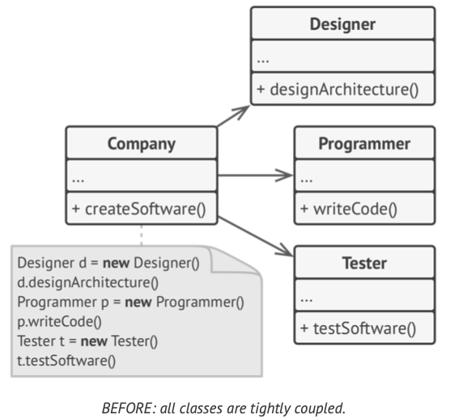
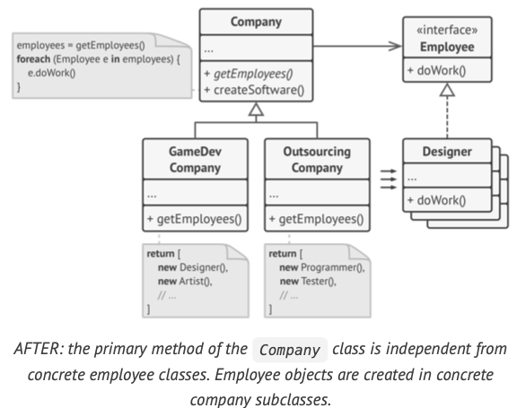
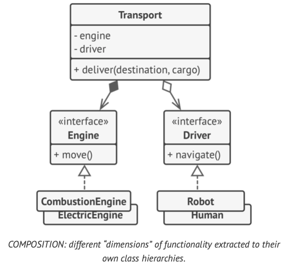

# Head First Design Patterns

[[toc]]

[toc]

> Notes on Eric Freeman' and Elisabeth Robson' "Head First Design Patterns". But with Javascript examples, and additional notes from other sources.

---

Design patterns are typical solutions to commonly occurring problems in software design. They are like pre-made blue- prints that you can customize to solve a recurring design prob- lem in your code.

All patterns can be categorized by their _intent_, or purpose.

-   **Creational patterns** provide object creation mechanisms that increase flexibility and reuse of existing code.
-   **Structural patterns** explain how to assemble objects and class- es into larger structures, while keeping the structures flexible and efficient.
-   **Behavioral patterns** take care of effective communication and the assignment of responsibilities between objects.

---

## Software design principles

Things to aim for and things you'd better avoid:

-   Code reuse

    Code reuse is one of the most common ways to reduce devel- opment costs. The _intent_ is pretty obvious: instead of developing something over and over from scratch, why don't we reuse existing code in new projects?

    The idea looks great on paper, but it turns out that making existing code work in a new context usually takes extra effort. Tight coupling between components, dependencies on concrete classes instead of interfaces, hardcoded operations; all of this reduces flexibility of the code and makes it harder to reuse it.

    Take what varies and _encapsulate_ it so it won't affect the rest of your code. The result? Fewer unintended consequences from code changes and more flexibility in your systems!

    Simply told: if you've got some aspect of your code that is changing, say with every new requirement, then you know you've got a behavior that needs to be pulled out and separated from all the stuff that doesn't change.

-   Extensibility

    > Change is the only constant thing in a programmer's life. There's a bright side tho: if someone asks you to change something in your app, that means someone still cares about it.

    First, we understand the problem better once we start to solve it. Often by the time you finish the first version of an app, you're ready to rewrite it from scratch because now you understand many aspects of the problem much better. You have also grown professionally, and your own code now looks like crap.

    That's why all seasoned developers try to provide and prepare for possible future changes when designing an application's architecture.

**Design principle(s):**

-   **_Program to an interface, not an implementation._**

    > _Program to an interface_ really means _Program to a supertype._

    You can tell that the design is flexible enough if you can easily extend it without breaking any existing code. Example how breaking down tighty coupled code into interfaces improves maintainability and extensibility:

    

    In the beginning, the `Company` class is tightly coupled to concrete classes of employees. However, despite the difference in their implementations, we can generalize various work-related methods and then extract a common interface for all employee classes.

    After doing that, we can apply polymorphism inside the `Company` class, treating various employee objects via the `Employee` interface.

    

    But, the `Company` class remains coupled to the employee classes. This is bad because if we introduce new types of companies that work with other types of employees, we'll need to override most of the `Company` class instead of reusing that code.

    

    To solve this problem, we could declare the method for get- ting employees as abstract. Each concrete company will implement this method differently, creating only those employees that it needs.

    After this change, the `Company` class has become independent from various employee classes. Now you can extend this class and introduce new types of companies and employees while still reusing a portion of the base company class. Extending the base company class doesn't break any existing code that already relies on it.

    Images above are an example of [Factory Method pattern](#the-factory-pattern).

-   **_Favor composition over inheritance._**

    Inheritance is probably the most obvious and easy way of reusing code between classes. You have two classes with the same code. Create a common base class for these two and move the similar code into it. Unfortunately, inheritance comes with some caveats:

-   **_identify the aspects of your application that vary and separate them from what stays the same._**

    The main goal of this principle is to minimize the effect caused by changes. As a result, you spend less time getting the program back into working shape, implementing and testing the changes. The less time you spend making changes, the more time you have for implementing features.

    -   _A subclass can't reduce the interface of the superclass._ You have to implement all abstract methods of the parent class even if you won't be using them.
    -   _When overriding methods you need to make sure that the new behavior is compatible with the base one._
    -   _Inheritance breaks encapsulation of the superclass_ because the internal details of the parent class become available to the subclass.
    -   _Subclasses are tightly coupled to superclasses._ Any change in a superclass may break the functionality of subclasses.
    -   _Trying to reuse code through inheritance can lead to creat- ing parallel inheritance hierarchies._ Inheritance usually takes place in a single dimension. But whenever there are two or more dimensions, you have to create lots of class combina- tions, bloating the class hierarchy to a ridiculous size.

    There's an alternative to inheritance called **composition**. Whereas inheritance represents the 'is a' relationship between classes (a car is a transport), composition represents the 'has a' relationship (a car has an engine).

    

    

## SOLID Principles

SOLID is a mnemonic for five design principles intended to make software designs more understandable, flexible and maintainable. They are introduced by Robert Martin in the book _Agile Software Development, Principles, Patterns, and Practices_.

## Strategy Pattern

> also known as the **Policy pattern**.

**The Strategy pattern** suggests that you take a class that does something specific in a lot of different ways and extract all of these algorithms into separate classes called `strategies`. The original class, called `context`, must have a field for stor- ing a reference to one of the strategies. The context delegates the work to a linked strategy object instead of executing it on its own.

The context isn't responsible for selecting an appropriate algorithm for the job. Instead, the client passes the desired strategy to the context. In fact, the context doesn't know much about strategies. It works with all strategies through the same generic interface, which only exposes a single method for triggering the algorithm encapsulated within the selected strategy.

This way the context becomes independent of concrete strategies, so you can add new algorithms or modify existing ones without changing the code of the context or other strategies.

> The strategy pattern is a behavioral design pattern that enables selecting an algorithm at runtime.
>
> -   [Wikipedia](https://en.wikipedia.org/wiki/Strategy_pattern)

The Strategy Pattern has several advantages:

-   It's easy to switch between different algorithms (strategies) in runtime because you're using polymorphism in the interfaces.
-   Clean code because you separate the concerns into classes (a class to each strategy) thus avoid conditional-infested code.

### When to Use the Strategy Pattern

-   When you need to use several algorithms with different variations. You need create a concrete class to implement your algorithm (which can consist of a or some functions).
-   When there are conditional statements around several related algorithms.
-   When most of your classes have related behaviors.

### Pseudocode

```ts
// The strategy interface declares operations common to all supported versions of some algorithm.
// The context uses this interface to call the algorithm defined by the concrete strategies.
interface Strategy is
	method execute(a, b)

// Concrete strategies implement the algorithm while following the base strategy interface.
//  The interface makes them interchangeable in the context.
class ConcreteStrategyAdd implements Strategy is
	method execute(a, b)
		is return a + b

class ConcreteStrategySubtract implements Strategy is
	method execute(a, b) is
		return a - b

class ConcreteStrategyMultiply implements Strategy is
	method execute(a, b) is
		return a * b

// The context defines the interface of interest to clients.
class Context is
	// The context maintains a reference to one of the strategy objects.
	// The context doesn't know the concrete class of a strategy.
	// It should work with all strategies via the strategy interface.
	private strategy: Strategy

	// Usually the context accepts a strategy through the constructor,
	// and also provides a setter so that the strategy can be switched at runtime.
	method setStrategy(Strategy strategy) is
		this.strategy = strategy

	// The context delegates some work to the strategy object instead of
	// implementing multiple versions of the algorithm on its own.
	method executeStrategy(int a, int b) is
		return strategy.execute(a, b)

	// The client code picks a concrete strategy and passes it to the context.
	//  The client should be aware of the differences between strategies in order to make the right choice.
	class ExampleApplication is
		method main() is

		Create context object.

		Read first number.
		Read last number.
		Read the desired action from user input.

		if (action == addition) then
			context.setStrategy(new ConcreteStrategyAdd())

		if (action == subtraction) then
			context.setStrategy(new ConcreteStrategySubtract())

		if (action == multiplication) then
			context.setStrategy(new ConcreteStrategyMultiply())

		result = context.executeStrategy(First number, Second number)

		Print result.
```

### Examples

#### Strategy Manager

```js
class StrategyManager {
	constructor() {
		//  represents the strategy used
		this.strategy = null;
	}

	get strategy() {
		return this.strategy;
	}

	set strategy(strategy) {
		this.strategy = strategy;
	}
	// The method doAction will be implemented in each concrete strategy
	doSomething() {
		this.strategy.doSomething();
	}
}

class StrategyA {
	doSomething() {
		console.log('StrategyA implementation');
	}
}

class StrategyB {
	doSomething() {
		console.log('StrategyB implementation');
	}
}

const strategyManager = new StrategyManager();
const strategyA = new StrategyA();
const strategyB = new StrategyB();

strategyManager.strategy = strategyA;
strategyManager.doSomething();

strategyManager.strategy = strategyB;
strategyManager.doSomething();
```

#### Greeter

```js
// Greeter is a class of object that can greet people.
// It can learn different ways of greeting people through 'Strategies.'

// This is the Greeter constructor.
const Greeter = function (strategy) {
	this.strategy = strategy;
};

// Greeter provides a greet function that is going to
// greet people using the Strategy passed to the constructor.
Greeter.prototype.greet = function () {
	return this.strategy();
};

// Since a function encapsulates an algorithm, it makes a perfect
// candidate for a Strategy.

// Here are a couple of Strategies to use with our Greeter.
const politeGreetingStrategy = function () {
	console.log('Hello.');
};

const friendlyGreetingStrategy = function () {
	console.log('Hey!');
};

const boredGreetingStrategy = function () {
	console.log('sup.');
};

// Let's use these strategies!
const politeGreeter = new Greeter(politeGreetingStrategy);
const friendlyGreeter = new Greeter(friendlyGreetingStrategy);
const boredGreeter = new Greeter(boredGreetingStrategy);

politeGreeter.greet(); //=> Hello.
friendlyGreeter.greet(); //=> Hey!
boredGreeter.greet(); //=> sup.
```

#### Sorting Strategy

```ts
// interface all sorting algorithms must implement
interface SortingStrategy {
	sort(array);
}
// heap sort algorithm implementing the `SortingStrategy` interface, it implements its algorithm in the `sort` method
class HeapSort implements SortingStrategy {
	sort() {
		log('HeapSort algorithm');
	}
}
// linear search sorting algorithm implementing the `SortingStrategy` interface, it implements its algorithm in the `sort` method
class LinearSearch implements SortingStrategy {
	sort(array) {
		log('LinearSearch algorithm');
	}
}
class SortingProgram {
	private sortingStrategy: SortingStrategy;
	constructor(array: Array<Number>) {
		this.array = array;
	}
	runSort(sortingStrategy: SortingStrategy) {
		return this.sortingStrategy.sort(this.array);
	}
}
// instantiate the `SortingProgram` with an array of numbers
const sortProgram = new SortingProgram([9, 2, 5, 3, 8, 4, 1, 8, 0, 3]);
// sort using heap sort
sortProgram.runSort(new HeapSort());
// sort using linear search
sortProgram.runSort(new LinearSearch());
```

#### Car Wash program

```ts
// Steve Fenton's example Car Wash program
interface BodyCleaning {
	clean(): void;
}
interface WheelCleaning {
	clean(): void;
}
class BasicBodyCleaningFactory implements BodyCleaning {
	clean() {
		log('Soap Car');
		log('Rinse Car');
	}
}
class ExecutiveBodyCleaningFactory implements BodyCleaning {
	clean() {
		log('Wax Car');
		log('Blow-Dry Car');
	}
}
class BasicWheelCleaningFactory implements BodyCleaning {
	clean() {
		log('Soap Wheel');
		log('Rinse wheel');
	}
}
class ExecutiveWheelCleaningFactory implements BodyCleaning {
	clean() {
		log('Brush Wheel');
		log('Dry Wheel');
	}
}
class CarWash {
	washCar(washLevel: Number) {
		switch (washLevel) {
			case 1:
				new BasicBodyCleaningFactory().clean();
				new BasicWheelCleaningFactory().clean();
				break;
			case 2:
				new BasicBodyCleaningFactory().clean();
				new ExecutiveWheelCleaningFactory().clean();
				break;
			case 3:
				new ExecutiveBodyCleaningFactory().clean();
				new ExecutiveWheelCleaningFactory().clean();
				break;
		}
	}
}
```

---

Looking at examples, it's noticeable that the key idea is to create objects which represent various strategies. These objects form a pool of strategies from which the context object can choose from to vary its behavior as per its strategy. These objects (strategies) perform the same operation, have the same(single) job and compose the same interface strategy.

### Structure


In the figure above, the `Context` class depends on the `Strategy`. During execution or runtime, different strategies of `Strategy` type are passed to the `Context` class. The Strategy provides the template by which the strategies must abide by for implementation.

### How to Implement

-   identify an algorithm that's prone to frequent changes. It may also be a massive conditional that selects and executes a variant of the same algorithm at runtime.
-   Declare the strategy interface common to all variants of the algorithm.
-   One by one, extract all algorithms into their own classes. They should all implement the strategy interface.
-   In the context class, add a field for storing a reference to a strategy object. Provide a setter for replacing values of that field. The context should work with the strategy object only via the strategy interface. The context may define an interface which lets the strategy access its data.
-   Clients of the context must associate it with a suitable strategy that matches the way they expect the context to perform its primary job.

### Strategy pattern resources

-   [The Strategy Pattern - Wikipedia](https://en.wikipedia.org/wiki/Strategy_pattern)

## The Observer Pattern

## The Factory Pattern

### Factory pattern resources

-   [Factory Pattern](https://addyosmani.com/resources/essentialjsdesignpatterns/book/#factorypatternjavascript)

## Resources

-   [Design Patterns: Elements of Reusable Object-Oriented Software by Gamma, Helm, Johnson, & Vlissides, Addison Wesley, 1995](https://www.amazon.com/Design-Patterns-Elements-Reusable-Object-Oriented/dp/0201633612)
-   [Pro TypeScript - Application-Scale JavaScript Development by Steve Fenton](https://www.amazon.com/Pro-TypeScript-Application-Scale-JavaScript-Development/dp/1484232488/ref=sr_1_1?s=books&ie=UTF8&qid=1543248511&sr=1-1&keywords=pro+typescript+steve+fenton)
-   [Dive Into Design Patterns by Alexander Shvets](https://refactoring.guru/design-patterns/book)
-   [Learning JavaScript Design Patterns](https://addyosmani.com/resources/essentialjsdesignpatterns/book/#factorypatternjavascript)
