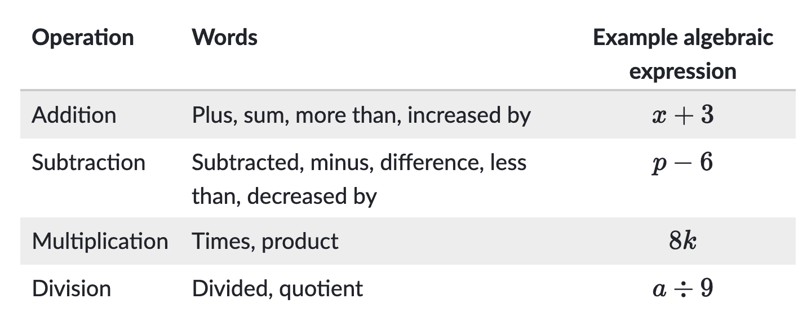
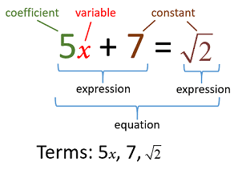
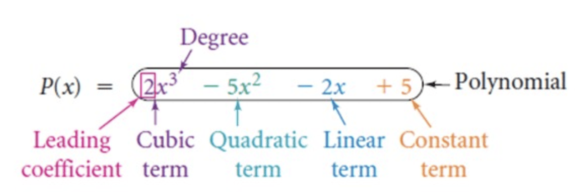
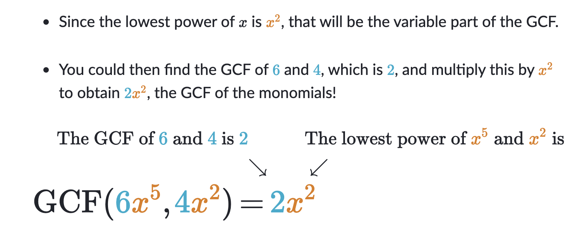
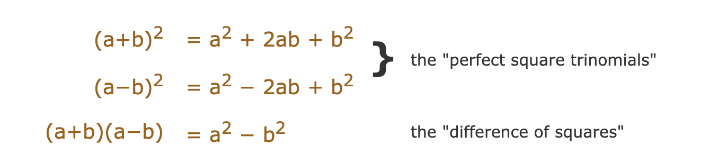
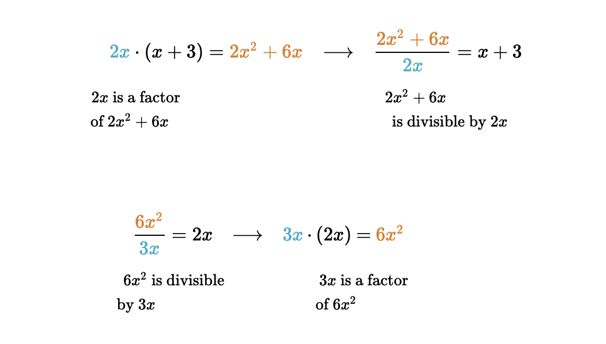
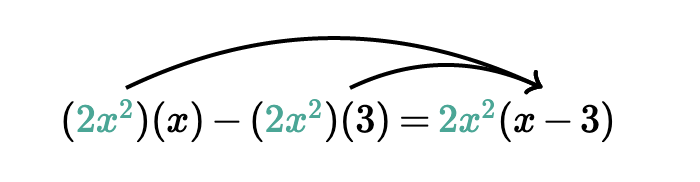
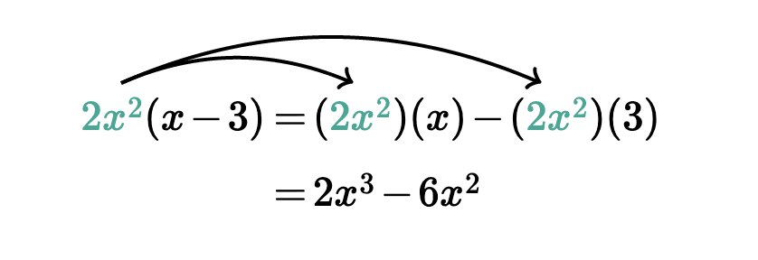

# Algebra

[[toc]]

[TOC]

---

Algebra is a method of written calculations that help us reason about numbers. At the very outset, we should realize that algebra is a skill. And like any skill - driving a car, baking cookies, playing the guitar - it requires (a lot of) practice.

The first thing to note is that in algebra we use letters as well as numbers. But the letters represent numbers. We imitate the rules of arithmetic with letters because we mean that the rule will be true for any numbers.

Here, for example, is the rule for adding fractions:

$$
\frac{a}{b}+\frac{b}{c}=\frac{a + b}{c}
$$

> The numbers are the numerical symbols, while the letters are called literal symbols.

---

## Algebraic Thinking

Algebraic thinking is a crucial and fundamental element of mathematical thinking and reasoning. It initially involves recognizing patterns and general mathematical relationships among numbers, objects and geometric shapes.

Here is a table that summarizes common words for each operation:

For example, the word product tells us to use multiplication. So, the phrase, "the product of eight and k", can be written as $8k$.

## Algebraic Expressions

An algebraic expression is a mathematical expression that consists of variables, numbers and operations. The value of this expression can change. Algebraic expressions are useful because they represent the value of an expression for all of the values a variable can take on.

**Constants** are a fixed quantity that does not change.

**Quantity** is just another way of saying an amount or a number of something

A **variable** is a symbol that we assign to an unknown value.We use variables when we need to indicate how objects are related even though we may not know the exact values of the objects.

**Coefficients** - The coefficient of a variable is the number that is placed in front (multiplied) of a variable. For example, $3 \times w$ can be written as $3w$ and 3 is the coefficient.

-   If the variable has no visible coefficient, then it has an implied coefficient of 1.
-   If the variable only has a negative sign, then it has an implied coefficient of -1.

A **factor** is one part of a product. The expression $4+n$ is one factor in the term $11(4+n)$, in the term $8x$ the factor are $8$ and $x$.

A **term** can be any of the following:

-   a constant - e.g. $3, 10, π, \frac{1}{2}$
-   the product of a number (coefficient) and a variable: $-3x, 11y, \frac{2}{3}a$
-   the product of two or more variables: $x^2, xy, 2y^2, 7xy$

**Expressions** - An expression is made up of one or more terms: $3w + 4xy + 5$

**Equations** - An equation consists of two expressions separated by an equal sign. The expression on one side of the equal sign has the same value as the expression on the other side: $4+6=5\cdot2$, $l = 3 \cdot w$, $3w + 4xy + 5=2w +3$

**Quadratic Equations** - A Quadratic Equation is an equation of the form:

$$
ax2 + bx + c = 0, \text{where a, b and c are numbers and } a ≠ 0
$$

**Algebraic Fraction** - An algebraic fraction is a fraction that contains an algebraic expression in its numerator and/or denominator. For example: $\frac{4}{2x-3}$

### Multiplication in algebra

The multiplication sign in algebra is a centered dot ($\cdot$). We do not use the multiplication cross $\times$, because we do not want to confuse it with the letter x.

However, we often omit the multiplication dot and simply write $ab$. In other words, **when there is no operation sign between two letters, or between a letter and a number, it always means multiplication**. $2x$ means $2 \cdot x$.

### Division in algebra

In algebra, we use the horizontal division bar (fraction separator).

$$
a=10,b=2 \newline
\frac{a}{b}= \frac{10}{2}=5
$$

> In algebra we call $a+b$ a **sum** even though we do not name an answer. Similarly, we call $a-b$ a **difference**, $ab$ a **product** and $\frac{a}{b}$ a **quotient**.

### Terms versus factors

When numbers are added or subtracted, they are called **terms**.

When numbers are multiplied, they are called **factors**.

Here is a sum of four terms:

$$
a − b + c − d
$$

> In algebra we speak of a "sum" of terms, even though there are subtractions. In other words, anything that looks like what is above, we call a sum.

Here is a product of four factors:

$$
abcd
$$

The word factor always signifies multiplication. And again, we speak of the "product" $abcd$, even though we do not name an answer.

In the following expression:

$$
2a+4ab+5a(b+c)
$$

there are four terms: $2a$, $4ab$ and $5a(b+c)$. $2a$ has two factors - $2$ and $a$,$4ab$ has three factors - $4$, $a$, $b$, $5a(b+c)$ also has three factors - $5$, $a$ and $(b+c)$. **The parentheses mean that we should treat whatever is enclosed as one number.**

### Writing expressions with variables

Some examples:

-   The sum of -7 and the quantity 8 times x: $-7 + 8x$
-   Take the quantity -3 times x, and then add 1: $-3x + 1$
-   -6 plus the product of -1 and x: $-6+-1x=-6+-x= -6-x$
-   $-1x$ is the same as $-x$ because 1 times something is always that something.
-   Eight less than the product of seven and x: $7x -8$

### Distributive property with variables

Some examples:

-   $\frac{1}{2}(2a - 6b + 8) = \frac{1}{2}(2a)-\frac{1}{2}(6b)+\frac{1}{2}(8)=a-3b+4=$
-   Apply the distributive property to factor out the GCF: $60m -40$
-   $60m - 40=20(3m - 2)$

### Like Terms

> The Combining Like Terms process is used to make equations easier to solve.

A term is a constant or a variable in an expression. In the equation $12+3x+2x^2=5x-1$, the terms on the left are $12$, $3x$ and $2x^2$, while the terms on the right are $5x$, and $-1$. Combining Like Terms is a process used to simplify an expression or an equation using addition and subtraction of the coefficients of terms.

Consider the algebraic expression below:

$$
12x + 7 + 5x
$$

$12x$ and $5x$ are like terms. Therefore the coefficients, 12 and 5, can be added. Which results in: $17x + 7$

Some examples of like terms are presented below:

-   The following are like terms because each term consists of a single variable, x, and a numeric coefficient.

$$
2x, 45x, x, 0x, -26x, -x
$$

-   Each of the following are like terms because they are all constants.

$$
15, -2, 27, 9043, 0.6
$$

-   Each of the following are like terms because they are all $y^2$ with a coefficient.

$$
3y^2, y^2, -y^2, 26y^2
$$

For comparison, below are a few examples of unlike terms:

-   The following two terms both have a single variable with an exponent of 1, but the terms are not alike since different variables are used.

$$
17x, 17z
$$

-   Each y variable in the terms below has a different exponent, therefore these are unlike terms.

$$
15y, 19y^2, 31y^5
$$

-   Although both terms below have an x variable, only one term has the y variable, thus these are not like terms either.

$$
19x, 14xy
$$

Things to keep in mind:

-   **Exponents and Bases**: You may have noticed that like terms always have the same base and exponent.
-   **Coefficients**: Also, the coefficient in front of a variable does not change whether or not terms are alike. For instance 3x and 5x and 11x are all like terms. The coefficients ( the '3' in 3x, '5' in 5x and '11' in 11x) do not have anything at all to do with whether or not the terms are like. All that matters is that each of 'x' factors or 'bases' have the same exponent.

Example of combining like terms in an expression:

$$
5x^2 + 7x + 2 - 2x^2 + 7 + x^2
$$

First, we identify sets of like terms. Both 2 and 7 are like terms because they are both constants, and the terms $5x^2$, $-2x^2$, and $x^2$ are like terms because they each consist of a constant times x squared.

Now the coefficients of each set of like terms are added. The coefficients of the first set are the constants themselves, 2 and 7. When added the result is 9. The coefficients of the second set of like terms are 5, -2, and 1. Therefore, when added the result is 4. With the like terms combined, the expression becomes:

$$
9 + 7x + 4x^2
$$

### Constant of proportionality

The constant of proportionality is a number that relates two variables in direct or inverse variation. In variable form, the constant of proportionality is commonly denoted as $k$.

$k=\frac{y}{x}$ $k=xy$

If $y$ varies directly with $x$, then the constant of proportionality will equal the product of $x$ and $y$ (above right).

#### Direct variation

Direct variation refers to a relationship between two variables where when one variable increases, the other increases by the same factor. The relationship between the two variables can be modeled by the equation $y = kx$, where $k$ is a constant of proportionality. The ratio of $y$ to $x$ will always equal $k$.

| x   | y   |
| --- | --- |
| 0   | 0   |
| 1   | 4   |
| 2   | 8   |
| 3   | 12  |
| 4   | 14  |

$y=4x$

> When someone says that y varies directly with $x$, or that $y$ is directly proportional to $x$, they mean that $y$ and $x$ exhibit direct variation

#### Inverse variation

Inverse variation refers to a relationship between two variables where when one variable increases, the other decreases by the same factor. The relationship between the two variables can be modeled by the equation $y =\frac{k}{x}$ , where $k$ is a constant of proportionality. The product of $x$ and $y$ will always equal $k$.

Inverse variation does not mean that when one variable increases, the other decreases. In order to maintain the same value of k, the value of x cannot be negative when y is positive.

> When someone says that y varies inversely with x, or that y is inversely proportional to x, they mean that y and x exhibit inverse variation.

### Simplifying expressions

Simplify $2(3x + 5)$:

$$
\begin{aligned}
	2(3x &+ 5) = \\
	2(3x) &+ 2(5) = \\
	6x &+ 10
\end{aligned}
$$

Simplify $7(3y-5)-2(10+4y)$

$$
\begin{aligned}
	7(3y-5)-2(10+4y) &= \\
	21y-35-20-8y &= \hspace{2em}\text{Pay attention to -5 and -2, as those are negative numbers}\\
	13y-55& \hspace{2em}\text{To simplify this even further, we subtract 8y from 21y and -35-20}
\end{aligned}
$$

Simplify $-3y+4xy-2x^2+2x+y^2-4xy+2y+3x^2$:

So, we can first rewrite this so that we can work with like terms:

$$
-3y +2y +4xy-4xy-2x^2+3x^2+2x+y^2 = \newline
-y + x^2 + 2x + y^2
$$

Simplify $7.4z-5(-1.6z+2.4)$:

$$
7.4z +(-5) \cdot (-1.6z) + (-5) \cdot (2.4) \newline
7.4z+8z-12 \newline
(7.4 + 8)z -12 \newline
15.4z-12
$$

Simplify $\frac{2^2-b^2}{2a+2b} \cdot \frac{3a-3b}{a^2-2ab+b^2}$:

$$
\begin{aligned}
	\frac{2^2-b^2}{2a+2b} \cdot \frac{3a-3b}{a^2-2ab+b^2} &= \\
	\frac{\cancel{(a\cdot b)}\cdot\cancel{(a\cdot b)}}{2\cancel{(a\cdot b)}} \cdot \frac{3\cancel{(a\cdot b)}}{\cancel{(a\cdot b)^{\cancel{2}}}} &= \frac{3}{2}
\end{aligned}
$$

Simplify $\frac{x+3}{x^2-9}\div \frac{x^3+27}{x^2-3x+9}$:

$$
\begin{aligned}
	\frac{x+3}{x^2-9}\div \frac{x^3+27}{x^2-3x+9} &= \\
	\frac{\cancel{x+3}}{(x-3)\cancel{(x+3)}} \div \frac{(x +3)\cancel{(x^2-3x+9)}}{x^2-3x+9} &= \\
	\frac{1}{x-3} \cdot \frac{1}{x+3}=\frac{1}{(x-3)(x-3)}
\end{aligned}
$$

Simplify $-y-3(-3y+5)$:

$$
-y-3(-3y+5)=-y+9y-15 \newline
-y+9y-15=8y-15
$$

## Polynomials

Polynomials are algebraic expressions that include real numbers and variables. Division and square roots cannot be involved in the variables. The variables can only include addition, subtraction, and multiplication.

> Polynomials contain more than one term. Polynomials are the sums of monomials.

-   A monomial has one term: $5y$ or $-8x^2$ or $3$.
-   A binomial has two terms: $-3x^2 2$, or $9y - 2y^2$
-   A trinomial has 3 terms: $-3x^2 2 \cdot 3x$, or $9y - 2y^2 y$

The **degree of the term** is the exponent of the variable: $3x^2$ has a degree of 2. When the variable does not have an exponent - always understand that there's a '1' e.g., $1^x$

Example of Polynomial in an Equation:

$$
x^2-7x-6
$$

|                      |                  |                            |
| -------------------- | ---------------- | -------------------------- |
| $8x^23x-2$           | Polynomial       |                            |
| $8x^{-3}7y-2$        | NOT a Polynomial | The exponent is negative.  |
| $9x^28x-\frac{2}{3}$ | NOT a Polynomial | Cannot have division.      |
| $9a^\frac{1}{3} - 5$ | NOT a Polynomial | Exponent is not an integer |
| $9a^a - 5$           | NOT a Polynomial | Exponent is a variable     |
| $7xy$                | Monomial         |                            |

Polynomials are usually written in decreasing order of terms. _The largest term or the term with the highest exponent in the polynomial is usually written first._ The first term in a polynomial is called a **leading term**. When a term contains an exponent, it tells you the degree of the term.

Here's an example of a three-term polynomial:

-   $6x^2 -4xy \cdot 2xy$: This three-term polynomial has a leading term to the second degree. It is called a second-degree polynomial and often referred to as a trinomial.
-   $9x^5-2x \cdot 3x^4 -2$: This 4 term polynomial has a leading term to the fifth degree and a term to the fourth degree. It is called a fifth-degree polynomial.
-   $3x^3$: This is a one-term algebraic expression that is referred to as a monomial.

### Simplifying polynomials

#### Adding and subtracting polynomials

Adding and subtracting polynomials is all about combining like terms.

Simplify $(5x^2+8x-3)+(2x^2-7x+13x)$:

$$
\begin{aligned}
	(5x^2+8x-3)&+(2x^2-7x+13x) = \\
	5x^2+8x-3&+2x^2-7x+13x = \\
	5x^2+2x^2&+8x-7x+13x-3 = \\
	7x^2&+14x-3
\end{aligned}
$$

Simplify $(16x+14)-(3x^2+x-9)$:

When we are subtracting an entire expression, a problem above can be rewritten by distributing the negative sign across all terms in the second trinomial:

$$
(16x+14)+-1(3x^2+x-9)
$$

In other words when we're subtracting an entire expression, that's equivalent to subtracting each of expression's terms individually.

And now we can simplify:

$$
\begin{aligned}
(16x+14)&+(-1(3x^2+x-9)) = \\
16x+14&-3x^2-x+9= \hspace{4em}\text{Explanation: -1⋅3=-3,-1⋅x=-x, -1⋅-9=9}\\
-3x^2+16x&-x+14+9 \\
-3x^2+15x&+23
\end{aligned}
$$

Simplify $(-5m^2-8)-(-3m^2+m+2)$:

$$
\begin{aligned}
	(-5m^2-8)-(-3m^2+m+2) =& \\
	-5m^2-8+(-1(-3m^2+m+2)) =& \\
	-5m^2-8+3m^2-m-2 =& \\
	-5m^2+3m^2-8-2-m =& \\
	-2m^2-10-m
\end{aligned}
$$

Simplify $6x^2+3x-9-(-2x^2+4x-1)$:

$$
\begin{aligned}
	6x^2+3x-9-(-2x^2+4x-1) \\
	6x^2+3x-9+2x^2-4x+1 \\
	6x^2+2x^2+3x-4x-9+1 \\
	8x^2-x-8
\end{aligned}
$$

#### Multiplying monomials

A monomial is an expression of the form $k\cdot x^n$, where k is a real number and n is a positive integer. It's basically a polynomial with a single term. When were are multiplying two monomials, we can rewrite the product as a single monomial using properties of multiplication and exponents.

$$
\begin{aligned}
	\text{\scriptsize We can rearrange the factors because multiplication is commutative} \\
	(5x^2)(3x^5)=5 \cdot 3 \cdot x^2 \cdot x^5 = 15x^{2+5=7}=15^7
\end{aligned}
\tag{1}
$$

$$
\begin{aligned}
	(3t^7)(-4t)=-12t^8
\end{aligned}
\tag{2}
$$

Solve $(3x^a)(bx^4)=-24x^6$:

$$
\begin{aligned}
	(3x^a)(bx^4)&=3b \cdot x^{a+4}= -24^6 \\
	\frac{\cancel{3}b}{\cancel{3}}&=\frac{-24}{3} = b = -8 \\
	a &= 6 -4 = 2 \\
	(3x^2)(-8x^4)&=-24x^6
\end{aligned}
$$

##### Multiply monomials by polynomials

We use the distributive property to multiply monomials by polynomials. For example, $2x(3x+7) = 6x^2+14x$.

$$
\begin{aligned}
	3b^2 \cdot 4b^4 + 3b^2 \cdot 2b + 3b^2 \cdot (-6) = \\
	12b^6+6b^3-18b^2
\end{aligned}
$$

##### Factoring monomials

A monomial is an expression that is the product of constants and nonnegative integer powers of $x$, like $3x^2$. A polynomial is a sum of monomials, like $3x^2 +6x -1$.

To factor a monomial means to express it as a product of two or more monomials. For example, below are several possible factorizations of $8x^5$:

-   $8x^5=(2x^2)(4x^3)$
-   $8x^5=(8x)(x^4)$
-   $8x^5=(2x)(2x)(2x)(x^2)$

To factor a monomial completely, we write the coefficient as a product of primes and expand the variable part. For example to completely factor $10x^3$ we can write the prime factorization of 10 as $2 \cdot 5$ and write $x^3$ as $x \cdot x \cdot x$. Therefore, this is the complete factorization of $10x^3$: $$10x^3=2\cdot5\cdot x \cdot x \cdot x$$

##### Finding missing factors of monomials

Suppose we have $8^5=(4x^3)(C)$ where $C$ is some monomial. We can find $C$ by dividing $8x^5$ by 4$x^3$:

$$
\begin{alignedat}{2}
	&8^5=(4x^3)(C) \\
	&\frac{8x^5}{4x^3}=\frac{(4x^3)(C)}{4x^3} &\text{ Divide both sides by }4x^3 \\
	&\frac{8}{4}\cdot\frac{x^5}{x^3}=2x^2 \\
	&2x^2=C &\text{Simplify with properties of exponents}
\end{alignedat}
$$

##### Greatest common factor of monomials

You can write the complete factorization of a monomial by writing the prime factorization of the coefficient and expanding the variable part.

Find the greatest common factor of these monomials:

Simply write the complete factorization of each monomial and find the common factors. The product of all the common factors will be the GCF.

$$
\begin{aligned}
	10cd^2 &= 2 \cdot \underline{5} \cdot \underline{c} \cdot\underline{d}\cdot\underline{d}\\
	25c^3d^2 &= 5 \cdot \underline{5} \cdot \underline{c} \cdot c \cdot c \cdot\underline{d}\cdot\underline{d}\\
	gcm &= 5 \cdot c \cdot d \cdot d = 5 cd^2
\end{aligned}
$$

#### Multiplying binomials

A binomial is a polynomial with two terms. For example, $x-2$ and $x-6$ are both binomials.

##### Special products of binomials

> Product means the result we get after multiplying.

There are three cases:

Remember above patterns, as they can save when solving algebra problems.

###### Add Times Subtract

This is also called is called the "**difference of two squares**" (the two squares being $a^2$ and $x^2$ bellow):

$$
(a-x)(a+x)=a^2-x^2
$$

Expanded:

$$
\begin{aligned}
(x+a)(x-a)=& \\
x(x+a)-a(x+a)=& \\
x^2+ax-ax-a^2=& \\
x^2+\cancel{ax}-\cancel{ax}-a^2 =& \\
x^2-a^2
\end{aligned}
$$

Another example:

$$
\begin{aligned}
	(x+10)(x-10)=& \\
	x^2 - 100
\end{aligned}
$$

###### Subtract Times Subtract

$$
\begin{aligned}
	(a−b)^2 = (a−b)(a−b) =& \\
	a-ab-ab+b^2 =& \\
	a^2 -2ab+b^2
\end{aligned}
$$

###### Multiplying a Binomial by Itself

$$
\begin{aligned}
(a+b)^2 = (a+b)(a+b) =& \\ a^2+ab+ab+b^2=& \\a^2 + 2ab+b^2
\end{aligned}
$$

##### Using Them

So far we have just used "a" and "b", but they could be anything.

Example $(y+1)^2$:

We can use the $(a+b)^2$ case where "a" is y, and "b" is 1:

$$
\begin{aligned}
	(y+1)^2 = (y)^2 + 2(y)(1) + (1)^2 = y^2 + 2y + 1
\end{aligned}
\tag{1}
$$

Example: $(3x−4)^2$:

We can use the $(a-b)^2$ case where "a" is 3x, and "b" is 4:

$$
\begin{aligned}
	(3x−4)^2 = (3x)^2 − 2(3x)(4) + (4)^2 = 9x^2 − 24x + 16
\end{aligned}
\tag{2}
$$

Example: $(4y+2)(4y−2)$:

We know the result is the difference of two squares, because:

$$
\begin{aligned}
	(a+b)(a−b) = a^2 − b^2
\end{aligned}
\tag{3a}
$$

so:

$$
\begin{aligned}
	(4y+2)(4y−2) = (4y)^2 − (2)^2 = 16y^2 − 4
\end{aligned}
\tag{3b}
$$

Sometimes we can see the pattern of the answer:

Example: which binomials multiply to get $4x^2 − 9$?

This is the difference of two squares, so:

$4x^2$ is $(2x)^2$, and $9$ is $(3)^2$, so we have:

$$
4x^2 − 9 = (2x)^2 − (3)^2
$$

And that can be produced by the difference of squares formula:

$$
(a+b)(a−b) = a^2 − b^2
$$

Like this ("a" is 2x, and "b" is 3):

$$
(2x+3)(2x−3) = (2x)^2 − (3)^2 = 4x^2 − 9
$$

So the answer is that we can multiply $(2x+3)$ and $(2x−3)$ to get $4x2 − 9$.

Another difference of squares example: Find the product of $(2x+8)(2x-8)$:

$$
(2x+8)(2x-8) = (2x)^2 - (8)^2 = 4x^2-64
$$

Examples:

-   Expand and combine like terms $(3z^5+7z^2)^2$:

We can expand this expression using the "perfect square" pattern (where P and Q can be any monomial):

$$
(p+q)^2=p^2+2pq+q^2
$$

Thus:

$$
\begin{aligned}
	&(3z^5+7z^2)^2 \\
   =&(3z^5)^2+2(3z^5)(7z^2)+(7z^2)^2 \\
   =&9z^{10}+42z^7+49z^4
\end{aligned}
$$

-   Expand and combine like terms $(7b^5-b^2)^2$

Since we have a minus sign, let's rewrite the binomial as a sum where the second term is negative, then use the pattern.

$$
\begin{aligned}
	&(7b^5-b^2)^2=(7b^5+(-b^2))^2\\
	=&(7b^5)^2+2(7b^5)(-b^2)+(-b^2)^2\\
	=&49^{10}-14b^7+b^4
\end{aligned}
$$

##### Multiplying binomials by polynomials

We can use distributive property for this as well:

$$
\begin{aligned}
	&(10a-3)(5a^2+7a-1) = 10a(5a^2+7a-1)-3(5a^2+7a-1)\\
	=&\thinspace50a^3+70a^2-10a-15a^2-21a+3 \\
	=&\thinspace50a^3+55a^2-31a+3
\end{aligned}
\tag{1}
$$

$$
\begin{aligned}
	&(x^2-\sqrt{6})(x^2+\sqrt{2})\\
	=&\thinspace x^2(x^2-\sqrt{6})+ \sqrt{2}(x^2-\sqrt{6})\\
	=&\thinspace x^4+x^2\sqrt{6}+x^2\sqrt{2}-\sqrt{12}\\
	=&x^4+x^2(\sqrt{2}-\sqrt{6})-\sqrt{3 \cdot 4} \\
	=&x^4+x^2(\sqrt{2}-\sqrt{6})-\sqrt{3}\sqrt{4} \\
	=&x^4+x^2(\sqrt{2}-\sqrt{6})-2\sqrt{3} \\
\end{aligned}
\tag{2}
$$

##### Factoring out binomial factors

The common factor in a polynomial does not have to be a monomial. For example, consider the polynomial $x(2x-1)-4(2x-1)$. Notice that the binomial $2x-1$ is common to the both term, and we can factor this out using the distributive property:

$$
x(2x-1)-4(2x-1)=(2x-1)(x-4)
$$

Another example:

Factor out the greatest common factor in the following polynomial:

$$
2x(x+3)+5(x+3)=(x+3)(2x+5)
$$

### Factors & Divisibility

In general, two integers that multiply to obtain a number are considered **factors** of that number. For example, since $14=2\cdot7$ we know that 2 and 7 are factors of 14. However, since $\frac{9}{4}=2.25$, 9 is not divisible by 4.

One number is divisible by another number if the result of the division is an integer. For example, since $\frac{15}{3}=5$, then 15 is divisible by 3 and 5.

Notice the mutual relationship between factors and divisibility, as in general: If $a$ is a factor of $b$, then $b$ is divisible by $a$, and vice versa.

#### Factors and divisibility in polynomials

> Polynomial factorization is very useful in solving quadratic equations and simplifying rational expressions.

When two or more polynomials are multiplied, we call each of these polynomials factors of the product. For example, we know that $2x(x+3)=2x^2+6$. This means that $2x$ and $x+3$ are factors of $2x^2+6$.

Also, one polynomial is divisible by another polynomial if the quotent is also a polynomial. For example, since $\frac{6x^2}{3x}=2x$ and since $\frac{6x^2}{2x}=3x$, then $6x^2$ is divisible by $3x$ and $2x$. However, since $\frac{4x}{2x^2}=\frac{2}{x}$, we know that $4x$ is not divisible by $2x^2$.

_The same relationship between factors and divisibility that was noted with integers can also be made here_:

In general, if $p=q \cdot r$ for polynomials $p, q$ and $r$, then we know the following:

-   $q$ and $r$ are factors of $p$.
-   $p$ is divisible by $q$ and $r$.

#### Determining factors and divisibility

In general, to determine whether one polynomial $p$ is divisible by another polynomial $q$, or equivalently whether $q$ is a factor of $p$, we can find and examine $\frac{p(x)}{q(x)}$. If the simplified form is a polynomial, then $p$ is divisible by $q$ and $q$ is a factor of $p$.

_Some examples:_

Is $24x^4$ divisible by $8x^3$?

To answer this question, we can find and simplify $\frac{24x^4}{8x^3}$. If the result is a monomial, then $24x^4$ is divisible by $8x^3$. If the result is not a monomial, then 2$4x^4$ is not divisible by $8x^3$.

$$
\begin{aligned}
	&\frac{24x^4}{8x^3} = \frac{24}{8} \cdot \frac{x^4}{x^3} \\
	&= 3 \cdot x^1 \hspace{3em}\text{because: } \frac{a^m}{a^n}=a^{m-n} \\
	&=3x
\end{aligned}
$$

Since the result is a monomial, we know that $24^4$ is divisible by $8x^3$, which also implies that 8$x^3$ is a factor of $24x^4$.

Is $4x^6$ a factor of $32x^3$?

If $4x^6$ is a factor of $32x^3$, then $32x^3$ is divisible by $4x^6$.

$$
\begin{alignedat}{2}
	&\frac{32x^3}{4x^6} = \frac{32}{4} \cdot \frac{x^3}{x^6} \\
	&= 8 \cdot x^{-3}  &\text{Because: } \frac{a^m}{a^n}=a^{m-n} \\
	&= 8 \cdot \frac{1}{x^3} &\text{Because: } a^{-m}=\frac{1}{a^m} \\
	&=\frac{8}{x^3}
\end{alignedat}
$$

Notice that term $\frac{8}{x^3}$ is not a monomial since it's a quotient, not a product. Therefore, we can conclude that $4x^6$ is not a factor of $32x^3$.

#### Factoring with the distributive property

To factor the GCF out of a polynomial, we do the following:

1. Find the GCF of all the terms in the polynomial.
2. Express each term as a product of the GCF and another factor.
3. Use the distributive property to factor out the GCF.

---

Let's factor $2x^3-6x^2$ by following these rules:

Step 1: Find the GCF

-   $2x^3 = 2 \cdot x \cdot x \cdot x$
-   $6x^2 = 2 \cdot 3 \cdot x \cdot x$

So the GCF of $2x^3-6x^2$ is $2 \cdot x \cdot x = 2x^2$

Step 2: Express each term as a product of $2x^2$ and another factor.

-   $2x^3=2x^2(x)$
-   $6x^2=(2x^2)(3)$

So the polynomial can be written as $2x^3 -6x^2=(2x^2)(x) - (2x^2)(3)$

Step 3: Factor out the GCF

Now we can apply the distributive property to factor out $2x^2$.

We can now verify our factorization by multiplying $2x^2$ back into the polynomial:

Since this is the same as the original polynomial, we can see that our factorization is correct!

> This can be a bit more efficient. Once we know the GCF, the factored form is simply the product of that GCF and the sum of the terms in the original polynomial divided by the GCF.

For example, we can use this method to factor $5x^2+10x$, whose GCF is $5x$:

$$
5x^2+10x=5x(\frac{5x^2}{5x}+\frac{10x}{5x})=5x(x+2)
$$

---

_Other examples:_

$$
4x+18 = 2(2x) + 2(9) = 2(2x+9)
\tag{1}
$$

$$
12 + 32y = 4(3 +8y)
\tag{2}
$$

## Equations

Whenever we have an equation with a variable, we call it an algebraic equation, for example:

$$
x + 2 = 6
$$

Simplify $9x^2-49$:

$$
9x^2-49 = (3x)^2 - 7^2=(3x-7)(3x+7)
$$

### Solving Equations

When working with equations, it's best to pretend that we have a hypothetical scale. For example, to solve $x+23=45$, we can say that on the right side there are 45 pennies and on the left side are 23 pennies and an unknown amount of pennies. The scale is balanced, therefore, we know that there must be an equal amount of weight on each side.

As long as the same operation (addition, subtraction, multiplication, etc.) is done to both sides of the scale, it will remain balanced. To find the unknown amount of pennies of the left side, remove 23 pennies from each side of the scale. **This action keeps the scale balanced and isolates the unknown amount.** Since the weight(amount of pennies) on both sides of the scale are still equal and the unknown amount is alone, we now know that the unknown amount of pennies on the left side is the same as the remaining amount (22 pennies) on the right side.

Because an equation represents a scale, it can also be manipulated like one. Below is a simple equation and the steps to solving it:

-   Initial problem: $x+23=45$
-   Subtract 23 from each side: $x + 23 - 23	=45 - 23$
-   Result: $x=22$

Now, a more complex equation. This equation has both a constant and a variable on each side. Again, to solve this we must keep both sides of the equation equal; perform the same operation on each side to get the variable "x" alone. The steps to solving the equation are shown below:

-   Initial problem: $x + 23=2x + 45$
-   Subtract x from each side: $x - x + 23	=2x - x + 45$
-   Result: $23	=x + 45$
-   Now, subtract 45 from each side: $23 - 45=2x + 45 - 45$
-   Result: $-22=2x$
-   Switch the left and right sides of the equation: $2x =-22$
-   This means that the unknown number multiplied by two, equals -22. To find the value of x, we can use the process "dividing by the coefficient":
-   Since we determined that the coefficient of x is 2, we divide each side of the equation by 2:
-   After dividing by 2: $1x	=-11$
-   Finally rewritten as $x	=-11$

More examples:

-   $a-5=-2 \newline a+5=-2+5 \newline a=3$
-   $a+5=54 \newline a-5=54-5 \newline a=49$

Based on this _balance beam model_, we know that we always have to do the same thing to both sides of an equation to keep it true. But how do we know what to do to both sides of the equation?

-   **Addition and subtraction are inverse operations:**

    -   Inverse operations are opposite operations that undo or counteract each other. Here's an example of how subtraction is the inverse operation of addition: $7+3−3=7$, an example of how addition is the inverse operation of subtraction: $5−2+2=5$.

-   **Multiplication and division are inverse operations:**
    -   Here's an example of how division is the inverse operation of multiplication: $7 \cdot 3 \div 3 = 7$, and here's an example of how multiplication is the inverse operation of division: $8 \div 4 \cdot 4=8$.

#### Solving an addition equation using inverse operations

Let's think about how we can solve for k in the following equation:

$$
k + 22 = 29
$$

We want to get k by itself on the left hand side of the equation. So, what can we do to undo adding 22?

We can subtract 22 because the inverse operation of addition is subtraction!

$$
\begin{aligned}
k + 22 &= 29 \\
k + 22 - 22 &= 29 - 22 \hspace{4.5em}\text{\{Subtract 22 from each side\}}\\
k&=7\hspace{11.7em}\text{\{Simplify\}}
\end{aligned}
$$

#### Solving a subtraction equation using inverse operations

Now let's try to solve a slightly different type of equation:

$$
p−18=3
$$

We want to get p by itself on the left hand side of the equation. So, what can we do to cancel out subtracting 18?

We can add 18 because the inverse operation of subtraction is addition!

$$
\begin{alignedat}{2}
p−18&=3 \\
p- 18 + 18&=3+18 \hspace{1em}&\text{\{Add 18 to each side.\}} \\
p&=21 &\text{\{Simplify\}}
\end{alignedat}
$$

#### Solving a multiplication equation using inverse operations

Let's think about how we can solve for t in the following equation: $6t=54$

We want to get t by itself on the left hand side of the equation. So, what can we do to undo multiplying by 6?

We should divide by 6 because the inverse operation of multiplication is division!

$$
\begin{alignedat}{2}
6t&=54 \\
\frac{6t}{6}&=\frac{54}{6} \hspace{1em}&\text{\{Divide each side by six\}}\\
t&=9 &\text{\{Simplify\}}
\end{alignedat}
$$

#### Solving a division equation using inverse operations

Now, let's try to solve a slightly different type of equation: $\frac{x}{5}=7$

We want to get x by itself on the left hand side of the equation. So, what can we do to cancel out dividing by 5?

We can multiply by 5 because the inverse operation of division is multiplication!

$$
\begin{alignedat}{2}
\frac{x}{5}&=7 \\
\frac{x}{5} \cdot 5 &= 7 \cdot 5 \hspace{1em}&\text{\{Multiply each side by five\}} \\
x&=35
\end{alignedat}
$$

#### Inverse Operations Summary

| Type of equation        | Example         | First step                  |
| ----------------------- | --------------- | --------------------------- |
| Addition equation       | $k+22=29$       | Subtract 22 from each side. |
| Subtraction equation    | $p-18=3$        | Add 18 to each side.        |
| Multiplication equation | $6t=54$         | Divide each side by six.    |
| Division equation       | $\frac{x}{5}=7$ | Multiply each side by five. |

---

Some examples with fractions and decimals:

$$
\begin{aligned}
	\frac{1}{3}+a&=\frac{5}{3} \\
	\frac{1}{3}-\frac{1}{3} +a &= \frac{5}{3}-\frac{1}{3} \\
	a &= \frac{5}{3}-\frac{1}{3} \\
	a &= \frac{4}{3}
\end{aligned}
\tag{1}
$$

$$
\begin{aligned}
	k-8&=11.8 \\
	k+8&=11.8+8 \\
	k&=19.8
\end{aligned}
\tag{2}
$$

$$
\begin{aligned}
	\frac{5}{13}&=t-\frac{6}{13}\\
	\frac{6}{13}+\frac{5}{13}&=t \hspace{4.5em} \text{\{-6/13 and +6/13 cancel each other\}}\\
	\frac{11}{13}&=t
\end{aligned}
\tag{3}
$$

$$
\begin{aligned}
	7x&=14 \\
	\frac{7x}{7}&=\frac{14}{7}\\
	x&=2
\end{aligned}
\tag{4}
$$

$$
\begin{aligned}
	1.2c&=0.6 \\
	\frac{\cancel{1.2}c}{\cancel{1.2}}&=\frac{0.6}{1.2}\hspace{4.5em} \text{\{Divide by 1.2 to simplify the left side\}}\\
	c&=\frac{0.6}{1.2}\hspace{4.5em} \text{\{Multiply by 10 to get rid of the decimal points\}}\\
	c&=\frac{6}{12}\\
	c&=\frac{1}{2}
\end{aligned}
\tag{5}
$$

$$
\begin{aligned}
	\frac{1}{4}&=\frac{y}{12}\\
	12 \cdot\frac{1}{4}&=\cancel{12}\cdot\frac{y}{\cancel{12}}\\
	\frac{12}{4}&=y\\
	3&=y
\end{aligned}
\tag{6}
$$

## Inequalities

> Inequalities show the relation between two expressions that are not equal.

Equations and inequalities are both mathematical sentences formed by relating two expressions to each other. In an equation, the two expressions are deemed equal which is shown by the symbol = as in $x=y$.

In an inequality, the two expressions are not necessarily equal which is indicated by the symbols: >, <, ≤ or ≥, as in $x > y$ or $x \geq y$

An equation or an inequality that contains at least one variable is called an **open sentence**. When you substitute a number for the variable in an open sentence, the resulting statement is either true or false. If the statement is true, the number is a solution to the equation or inequality.

### Compound inequalities

A compound inequality consists of two or more inequalities. There are two types of compound inequalities: compound inequalities joined by the word "and" and compound inequalities joined by the word "or."

Example:

$$
-6 \lt x \leq 2
$$

This can be written as following:

$$
x \gt -6 \text{ and } x \leq 2
$$

Compound inequalities joined by "and" are also called the "**intersection**" of two inequalities.

To solve compound inequalities joined by the word "and," apply the rules for inequalities to all sides of the compound inequality. If you multiple or divide the compound inequality by a negative number, you will need to flip all the inequality signs.

Example:

$$
\begin{aligned}
	3 \leq -6x& + 9 \lt 6 \\
	-6 \leq -6&x \lt -3 \\
	1 \geq x& \gt \frac{1}{2} \\
	\frac{1}{2} \lt x& \leq 1
\end{aligned}
$$

---

$$
x \lt -4 ; x \geq -1
$$

This can also be written as the following:

$$
x \lt -4 \text{ or } x \geq -1
$$

Compound inequalities joined by "or" are also called the "**union**" of two inequalities.

To solve compound inequalities joined by the word "or," solve each inequality separately. Treat each inequality as its own singular inequality, determine the result of the individual inequalities, then combine the results.

Example:

$$
\begin{alignedat}{2}
	-4x+5 \lt 13& \text{ or } &-2x - 8 \geq 4 \\
	   -4x \lt 8& 			  &-2x \geq 12 \\
	   x \leq -6& 			  &x \gt -2
\end{alignedat}
$$

### Solving inequalities

To solve inequalities, you can apply most of the same principles used when solving equations. When solving inequalities, nothing changes when adding, subtracting, or multiplying and dividing by a positive number. As with equations, when we add or subtract the same number on both sides of the truth of the inequality doesn't change.

This holds true for all numbers:

-   $x\gt y\rarr x\lt y\rarr$
-   $x+z\gt y+z\rarr x+z\lt y+z\rarr$
-   $x−z\gt y-zx-z\lt y-z$

Example:

-   $x+3\gt9$
-   $x+3-3\gt9−3$
-   $x\gt6$

---

It is a little bit trickier when it comes to division and multiplication. When we multiply or divide an inequality by a positive integer, the truth of the inequality doesn't change:

-   $x\gt y\rarr$
-   $x⋅z\gt y⋅z\rarr$
-   $\frac{x}{z} \gt \frac{y}{z}$
-   $If \hspace{0.1em}z \gt 0$

But, **when we multiply or divide an inequality by a negative integer, the sign of the inequality will be reversed (changed)**:

-   $x\gt y\rarr$
-   $x⋅z\lt y⋅z\rarr$
-   $\frac{x}{z} \lt \frac{y}{z}$
-   $If \hspace{0.1em}z \lt 0$

Example:

-   $\frac{x}{-2} \geq 3$
-   $\frac{x}{-2}\cdot -2 \geq 3 \cdot -2$
-   $x \leq -6$
-   Solve $2-3x \lt 14$:
    -   We can treat this just like a normal algebra equation, but we need to keep in mind that when we multiply or divide by a negative number we need to flip around $\lt$ to $\gt$, the inequality has to change a sign.
    -   We can start by subtracting 2 from both sides, which results in: $-3x \lt 12$
    -   At this point we're going to divide by the negative 3, but we need to be very careful, because when we're dividing or multiplying by a negative number, inequality changes sign: $\frac{\cancel{-3}x}{\cancel{-3}}\lt \frac{12}{-3}=x \gt -4$
-   Solve $x+2 \leq 2x$:
    -   $x+2 \leq 2x=x+2-2 \leq 2x -2 = x \leq x$
-   Solve $3x +4 \gt 5x$:
    -   $3x +4 -4 \gt 5x -4 = 3x \gt 1x$

### Inequalities involving polynomials

When solving inequalities involving polynomials, you need to simplify the inequality so that one side equals zero. This is similar to the format of a quadratic equation $ax^2 + bx + c =0$. By setting one side of the inequality equal to zero, you create a relationship where the solution to the inequality depends on the zeros of the polynomial.

## Dependent and independent variables

On a graph, the dependent variable is typically plotted on the _y-axis_ and the independent variable is plotted on the _x-axis_.

Example:

-   $y=2x$

In the function above, $y$ is the dependent variable, and $x$ is the independent variable. If the value of $x$ is said to be 1 (input), then the value of $y$ will be 2 (output).

### Independent variable

> An independent variable is not influenced by another variable. They are sometimes called the “argument” of the function.

An **independent** variable is a variable that represents a quantity that is being manipulated in an experiment. $x$ is often the variable used to represent the independent variable in an equation.

Example:

You are doing chores to earn your allowance. For each chore you do, you earn \$3. The independent variable here is the amount of chores you do because this is the variable you have control over.

### Dependent variables

> A dependent variable is determined by another variable. They are dependent on the “input” value. Dependent variables represent the “output” value of a function, and they are sometimes called the “value” of the function.

A **dependent** variable represents a quantity whose value depends on how the independent variable is manipulated. $y$ is often the variable used to represent the dependent variable in an equation.

The dependent variable in above example is the amount of money you earn because the amount of money you earn depends on how many chores you do.

### How to Tell the Variables Apart

The independent and dependent variables may be viewed in terms of cause and effect. **If the independent variable is changed, then an effect is seen in the dependent variable.** Remember, the values of both variables may change in an experiment and are recorded. The difference is that the value of the independent variable is controlled by the experimenter, while the value of the dependent variable only changes in response to the independent variable.
