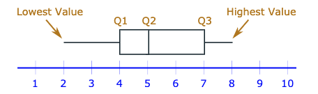
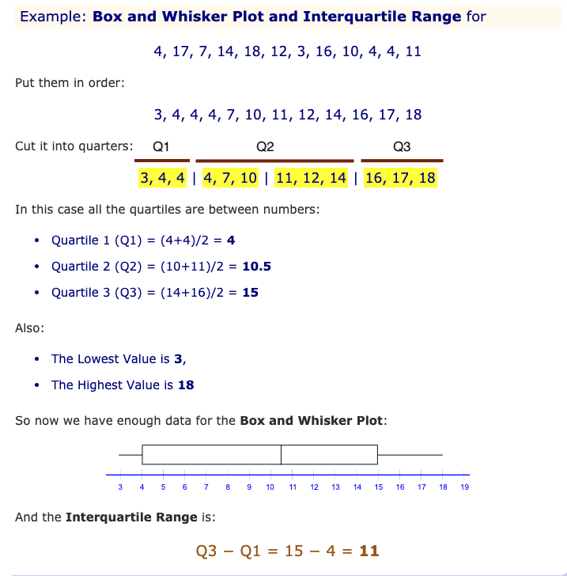

# Data, Probability and statistics

[[toc]]

[TOC]

## Data

> Data is a collection of facts, such as numbers, words, measurements, observations or even just descriptions of things.

Data can be qualitative or quantitative.

-   **Qualitative** data is descriptive information (it describes something)
-   **Quantitative** data is numerical information (numbers)

Quantitative data can be Discrete or Continuous:

-   **Discrete data** can only take certain values (like whole numbers)
-   **Continuous data** can take any value (within a range)

> Put simply: Discrete data is counted, Continuous data is measured

### How to Show Data

-   Bar Graphs
-   Pie Charts
-   Dot Plots
-   Line Graphs
-   Scatter (x,y) Plots
-   Pictographs
-   Histograms
-   Frequency Distribution and Grouped Frequency Distribution
-   Stem and Leaf Plots
-   Cumulative Tables and Graphs

## Statistics

> The Statistics is study of data: how to collect, analyze, summarize and present it.

In statistics, we try to make sense of the world by collecting, organizing, analyzing, and presenting large amounts of data.

### Central values

There are other ways of measuring central values, but Mean, Median and Mode are the most common.

#### Mean (Average)

To calculate the mean we just need to follow these steps:

1. Add up all of the data points (numbers)
2. Divide the total by the number of data points in the data set (number of numbers)

$$
(3+7+8) / 3 = 18/3 = 6
$$

#### Median

> List all numbers in order and choose the middle one

Example:

$1, 1, 1, 1, 1, \underline{13}, 13, 13, 13, 13, 13$

Sometimes there are two middle numbers. Just average those two:

$3, 4, \underline{7, 9}, 12, 15$

$(7+9) / 2 = 16/2 = 8$, thus the median is $8$.

#### Mode

> The Mode is the value that occurs most often:

$$
1, 1, 1, 1, 1, \textcolor{blue}{13},\textcolor{blue}{13},\textcolor{blue}{13},\textcolor{blue}{13},\textcolor{blue}{13},\textcolor{blue}{13}
$$

13 occurs 6 times, 1 occurs only 5 times, so the mode is 13.

There can sometimes be more than one Mode:

$$
3, \textcolor{blue}{4},\textcolor{blue}{4}, 5, \textcolor{green}{6},\textcolor{green}{6}, 7
$$

4 occurs twice but 6 also occurs twice. So both 4 and 6 are modes.

When there are two modes it is called _bimodal_, when there are three or more modes we call it _multimodal_.

#### Harmonic Mean

The Harmonic Mean is good at handling large outliers:

Example: $2, 4, 6$ and $100$:

The arithmetic mean is $\frac{2+4+6+100}{4}=28$

The harmonic mean is $4/(\frac{1}{2}+\frac{1}{4}+\frac{1}{6}+\frac{1}{100})=4.32$

But for small outliers this will make things only less accurate!

#### Central Values problems

Find the missing value if we know:

$$
\begin{aligned}
	4 &= \frac{5+2+x+2+4+8}{6} \\
	4 &= \frac{21+x}{6} \\
	4 \cdot 6 &= \frac{21+x}{\cancel{6}} \cdot \cancel{6} \\
	24 &= 21 +x \\
	24 - 21 &= x = 3
\end{aligned}
$$

This is a vastly simplified example, but oh well...

### Interquartile ranges

In descriptive statistics, the interquartile range, also called the midspread, middle 50%, or H‑spread, is a measure of statistical dispersion, being equal to the difference between 75th and 25th percentiles, or between upper and lower quartiles, IQR = Q₃ − Q₁. In other words, the IQR is the first quartile subtracted from the third quartile; these quartiles can be clearly seen on a box plot on the data. It is a trimmed estimator, defined as the 25% trimmed range, and is a commonly used robust measure of scale.

$$
IQR = Q_3 - Q_1
$$

Before determining the interquartile range, we first need to know the values of the first quartile and third quartile. (Of course, the first and third quartiles depend upon the value of the median). Once we have determined the values of the first and third quartiles, the interquartile range is very easy to calculate. All that we have to do is to subtract the first quartile from the third quartile. This explains the use of the term interquartile range for this statistic.

> The primary advantage of using the interquartile range rather than the range for the measurement of the spread of a data set is that the interquartile range is not sensitive to outliers.

An example of the calculation of an interquartile range:

Consider the set of data: $2,6,9,12,18,19,27,15,7,5,1$

**Step 1:** Put the numbers in order.

$$
1, 2, 5, 6, 7, 9, 12, 15, 18, 19, 27
$$

**Step 2:** Find the median.

$$
1, 2, 5, 6, 7, \underline{9}, 12, 15, 18, 19, 27
$$

**Step 3:** Place parentheses around the numbers above and below the median. Not necessary statistically, but it makes Q1 and Q3 easier to spot.

$$
(1, 2, 5, 6, 7), 9, (12, 15, 18, 19, 27)
$$

**Step 4:** Find Q1 and Q3 Think of Q1 as a median in the lower half of the data and think of Q3 as a median for the upper half of data.

$$
(1, 2, \underline{5}, 6, 7),  9, ( 12, 15, \underline{18}, 19, 27) \\ Q1 = 5 , Q3 = 18
$$

**Step 5:** Subtract Q1 from Q3 to find the interquartile range.

$$
18 - 5 = 13
$$

#### What if we have an even set of numbers

Sample question: Find the IQR for the following data set: $3, 5, 7, 8, 9, 11, 15, 16, 20, 21$.

**Step 1:** Put the numbers in order.

$$
3, 5, 7, 8, 9, 11, 15, 16, 20, 21.
$$

**Step 2:** Make a mark in the center of the data:

$$
3, 5, 7, 8, 9, \underline{|} 11, 15, 16, 20, 21.
$$

**Step 3:** Place parentheses around the numbers above and below the mark you made in Step 2 - it makes Q1 and Q3 easier to spot.

$$
(3, 5, 7, 8, 9), | (11, 15, 16, 20, 21).
$$

**Step 4:** Find Q1 and Q3 Q1 is the median (the middle) of the lower half of the data, and Q3 is the median (the middle) of the upper half of the data.

$$
(3, 5, \underline{7}, 8, 9), | (11, 15, \underline{16}, 20, 21) \\ Q1 = 7 , Q3 = 16
$$

**Step 5:** Subtract Q1 from Q3.

$$
IQR = 16 - 7 = 9.
$$

---

#### Box and Whisker Plot

We can show all the important values in a "Box and Whisker Plot", like this:

Example with everything combined:

### Mean Absolute Deviation

> Mean Absolute Deviation is also referred to as the average absolute deviation.

Mean Deviation tells us how far, on average, all values are from the middle.

Formula:

$$
Mean \hspace{0.3em} Deviation = \frac{\sum |x - \mu|}{N}
$$

To break down this:

-   $\sum$ is Sigma, which means to sum up,
-   $||$ vertical bars means Absolute value
-   $x$ is each vaue (such as 13 or 7)
-   $\mu$ is the mean
-   $N$ is the number of values

Example:

The Mean Deviation of $3, 6, 6, 7, 8, 11, 15, 16$:

**Step 1:** find the mean:

$$
\mu = \frac{3+ 6+ 6+ 7+ 8+ 11+ 15+ 16}{8} = \frac{72}{8}= 9
$$

**Step 2:** Find the Absolute Deviations:

| $x$ | $\|x-\mu\|$          |
| --- | -------------------- |
| 3   | 6                    |
| 6   | 3                    |
| 6   | 3                    |
| 7   | 2                    |
| 8   | 1                    |
| 11  | 2                    |
| 15  | 6                    |
| 16  | 7                    |
|     | $\sum\|x - \mu\|=30$ |

**Step 3:** Find the Mean Deviation:

$$
MD=\frac{\sum|x-\mu|}{N}=\frac{30}{8}=3.75
$$

> To make sure that we have a correct result we should be aware that the deviations on one side of the mean should equal the deviations on the other side. In above example: $6+3+3+2+1 = 2+6+7$

### Gaps, Clusters and Outliers

Gaps, clusters and outliers are characteristics of data sets that influence mathematical analysis and are readily visible on visual representations.

#### Gaps

> Holes in the Data

Gaps refer to missing areas in a data set. For example, if a scientific experiment collects temperature data in the range of 50 degrees Fahrenheit to 100 degrees Fahrenheit, but nothing between 70 and 80 degrees, that would represent a gap in the data set

#### Clusters

> Isolated Groups

Clusters are isolated groups of data points. Line plots, which are one of the ways to represent data sets, are lines with "x" marks placed above specific numbers to depict their frequency of occurrence in the data set. A cluster is depicted as a collection of these "x" marks in a small interval or data subset. For example, if the exam scores for a class of 10 students are $74, 75, 80, 72, 74, 75, 76, 86, 88$ and $73$, the most "x" marks on a line plot would be in the 72-to-76 score interval. This would represent a data cluster. Note the frequency for 74 and 75 is two, but for all other scores, it is one.

#### Outliers

Outliers are extreme values -- data points that lie significantly outside other values in a data set. An outlier must be significantly less than or greater than the majority of numbers in a data set. The definition of "extreme" depends on the circumstance and a consensus of the analysts involved in the research. Outliers might be bad data points, also known as _noise_, or they might contain valuable information about the phenomenon being investigated and the data collection methodology itself.

They can change the mean a lot, so we can either not use them (and say so) or use the median or mode instead.

For Example:

The mean of $3, 4, 4, 5, 104$ is 24, which isn't really a representation of these numbers. Without the $104$ the mean is: $(3+4+4+5) / 4 = 4$ which is much more representative. The median of the same numbers is $4$ as well as the mode.
