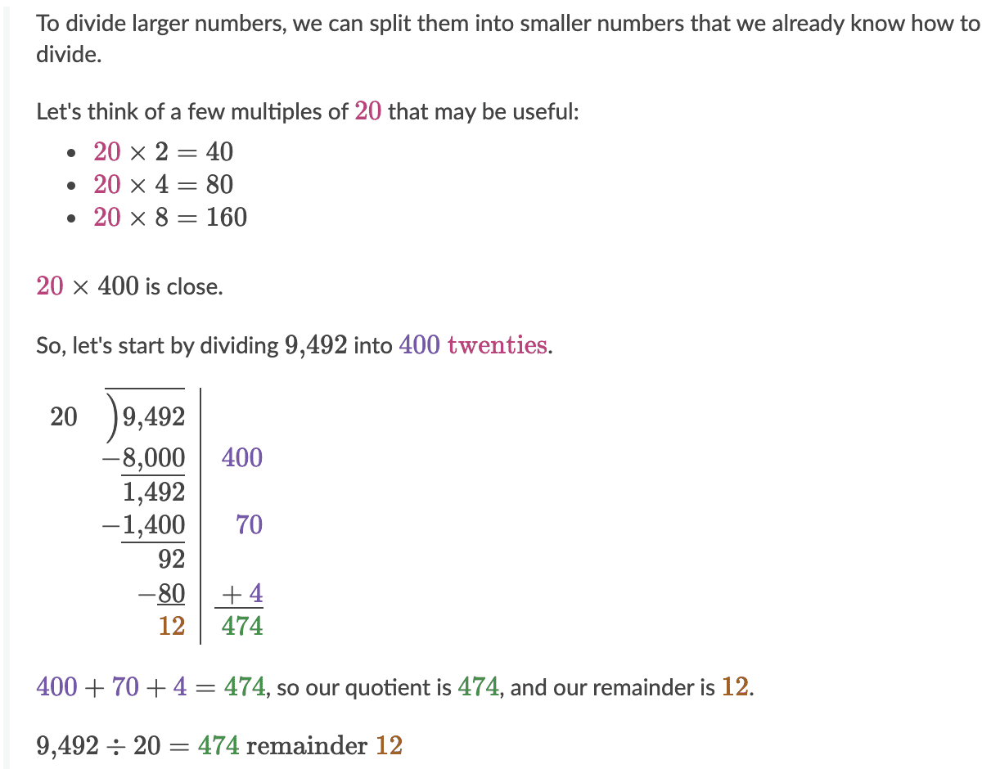

# Division

[[toc]]

[TOC]

---

$$
dividend \div divisor = quotient
$$

---

Same rules as for multiplication regarding division with negative numbers:

-   if we divide two negative numbers the result will always be a positive
-   if we divide positive with negative number and vice versa the result will always be a negative number
-   to test if something is divisible by 3, we can found out by adding up all the digits of the number and see if result is divisible by 3.

## Division using place value

$$
5600 / 8 = (56 \times 100) / 8 = 56 / 8 = 7 \times 100 = 700
$$

$$
7200 / 6 = (72 \times 100) / 6 = 72 / 6 = 12 \times 100 = 1200
$$

$$
15000 / 15 = (15 \times 1000) / 15 = 15 / 15 = 1 \times 1000 = 1000
$$

## Division using distributive property

$$
846 / 2 = (800 / 2) + (40 / 2) + (6 / 2) = 400 + 20 + 3 = 423
$$

Here we skip division by (3 / 9) because 9 goes 0 times into 3:

$$
963 / 9 = (900 / 9) + (63 / 9) = 100 + 7 = 100
$$

## Division using long division

$$
280 / 5 = 5\sqrt{280} = 56
$$

```js
5√‾‾280 = 056 // 5 goes into 2 zero times, we subtract 0 from 2
  - 0         // when we have number which is smaller than (5), we can skip it and go straight to the (28 - next greater or equal) like in this case
    ----      // move to the next number (8), write 0
    28        // shift down 8, 5 goes into 28 five times, write 5
  - 25        // 5 x 5 = 25, we have 3 left
    ----      // shift down next number (0)
     30       // 5 goes into 30 six times, write 6
   - 30       // 5 x 6 = 30
     ----
      0       // We're done, we have remainder of zero
```

```js
4√‾‾424 = 106  // 4 goes into 4 one time, write 1
  - 4        // 4 x 1 = 4
    ----     // we can shift down 2, but 4 goes into 2 zero times, so we shift down 24, and write 0
    024      // 4 goes into 24 six times, write 6
   - 24      // 4 x 6 = 24
     -----
      0      // We're done, we have remainder of zero
```

## Quotients that are multiples of 10

When dividing 240 by 3 we can omit the zero from the end and divide just 24 by 3, whis is equal to 8, and then we add back zero we removed at the start so the result is 80.

$$
  4200 / 7 = 42 / 7 = 6(00)
$$

## Canceling zeros when dividing

Given:

$$ 350 / 50 $$

We can cancel out zeros and divide just `35 / 5` which is equal to 7.

$$
420 / 70 = 42 / 7 = 6
$$

$$
5600 / 80 = 560 / 8 = 56 / 8 = 7(0)
$$

## Dividing by two digit numbers

$$
186 / 31 = 31\sqrt{186} = 6
$$

because:

$$
31 \times 6 = 186
$$

## Dividing by zero

Zero divided by any non-zero value will be equals to zero:

$$
\frac{0}{-5} = 0
$$

On the other hand, we don't have defined result for numbers divided by zero, traditionaly for this calculations the end result is `undefined`:

$$
\frac{-5}{0} = undefined
$$

$$
\frac{0}{0} = undefined
$$

## Multi-digit division

### Strategies for dividing multiples of 10, 100, and 1000

These are equal: $2400 / 30 = \frac{2400}{30}$ . We can then simplify this to: $2400 / 30 = \frac{2400}{30} = \frac{24 \times 100}{3 \times 10}$. Whats valuable about thinking this way is that we can separately divide 24 by 3 and 100 by 10, which gives us: $...=\frac{42}{3} \times \frac{100}{10} = 8 \times 10 = 80$.

Another (a bit hacky) thing that we an do here is to evaluate $2400 / 30$, then divide 24 by 3, and from 2400 zeros cancel one because of one zero in 30, that would left us with 8 and 0 which grouped together gives us 80.

Another example:

$$
3500 / 700 = \frac{3500}{700} = \frac{35 \times 100}{7 \times 100}=\frac{35}{7} \times \frac{100}{100} = 5 \times 1 = 1
$$

or, by simplifying and cancelling zeroes:

$$
3500 / 700 = 35\cancel{0}\cancel{0} / 7\cancel{0}\cancel{0} = 35 / 7 = 5
$$

Also, we can use strategies for multiplying/dividing by the powers of then mentioned [here](./multiplication.md#exponents) and when working on problems like $7 \div 10$ we just need to move _divident_ (7) one place to the right, so that the result is: $0.7$.

More examples:

-   $\frac{34}{10}=34 \div 10=3.4$
-   $53 \div 100 = 0.53$
-   $1098\div100=10.98$
-   $\frac{2}{100}=2\div100=0.02$

---

## Remainders

> Leftover value after we divide something that can't be divided evenly

$$ 7/3 = 2r1 $$

3 goes in the 7 two times, and once we divide that amount $(2 \times 3 = 6)$ we have 1 (remainder) left.

> More examples in Remainder section in the notebook (it's really hard to write that in KaTeX).

```js
4√‾‾75 = 18r3
  - 4     // 4 goes in 7 once; write 1; 4 x 1 = 4, 7 - 4 = 3
  ----    // shift down 5
    35    // 4 goes into 35 8 times; write 8; 4 x 8 = 32;
    32
    ---- // No numbers to shift down, we're left with the 3
     3   // 4 goes into 3 zero times, so this will be a remainder
```

$$
\begin{gathered}
   4\surd75 = 18r3\\ \hline
   - 4 \\ \hline
35 \\
-\medspace32\\ \hline
3
\end{gathered}
$$

```js
8√‾‾3771 = 0471r3
  - 32    // 8 goes into 32 4 times; write 4
    ----
     57   // 8 goes into 57 7 times; write 7
     56
     ----
      11  // 8 goes into 17 once; write 1
       8
      ----
       3  // We're left with 3; 8 goes into 3 zero times, so this would be a remainder.
```

Another way to simplify dividing large numbers, $9420 \div 20$ can be calculated like this:



For above example we can represent the result as a fraction: $474\frac{12}{20}$, which can be further simplified to decimal like so: $474+(\frac{12}{20}\times\frac{5}{5})=474\frac{60}{100}=474.6$ or to a smaller fraction like this: $474\frac{12}{20}=474\frac{3}{5}$.

## Dividing decimals

### Dividing whole numbers to get a decimal

Let's say we have $63 \div 35$. Obviously, this is not resulting in a whole number, but we can still use long division algorithm with an additional strategy to calculate this:

$$
\begin{aligned}
{35}{)}\hspace{-0.4em}\overline{\hspace{0.5em}\phantom{`}}63&.000=1.8 \hspace{2em}\text{Explanation}\\
&\underline{35}\hspace{5em}\text{(1 times 35)}\\
&28\hspace{0.1em}0 \hspace{4.5em}\text{(we move down tenth place .0)}\\
&\underline{280}\hspace{4.5em} \text{(8 times 35)}\\
&\underline{0}
\end{aligned}
$$

### Dividing a decimal by a whole number

Let's say we have $5.005 \div 7$. We can rewrite this as:

$$
\begin{aligned}
{7}{)}\hspace{-0.4em}\overline{\hspace{0.5em}\phantom{`}}&5.005=0.715\\
&\underline{0}\\
&5\hspace{0.1em}0\\
&\underline{49}\\
&1\hspace{0.1em}0\\
&\underline{7}\\
&3\hspace{0.1em}5\\
&\underline{35}\\
&0\\
\end{aligned}
$$

> When dividing a decimal by a whole number we can proceed just like it's regular long division, we just need to keep in mind how many digits are to the right of the whole number.

### Dividing a whole number by a decimal

Let's say we have $518 \div 0.7$. The first thing we should do, since we have decimal as divisor, is to try to turn it into a whole number. In this case we can do that by multiplying it by 10, so that we get 7. _We also have to multiply dividend by ten._ Then we can proceed as with a regular long division.

$$
\begin{aligned}
{7}{)}\hspace{-0.4em}\overline{\hspace{0.5em}\phantom{`}}&5180.0=740.0\\
&\underline{49}\\
&\phantom{``}2\hspace{0.1em}8\\
&\phantom{``}\underline{28}\\
&\phantom{````}0\hspace{0.1em}0\\
&\phantom{``````}\underline{0}\\
&\phantom{``````}0\\
\end{aligned}
$$

### Long division with decimals

Let's say we have $2.211 \div 6.7$. We should simplify this first, bu making divisor a whole number, thus: $\frac{2.211}{6.7} \times \frac{10}{10}=\frac{22.11}{67}$. Then we can do long division:

$$
\begin{aligned}
{67}{)}\hspace{-0.4em}\overline{\hspace{0.5em}\phantom{`}}&22.11=0.33\\
&\phantom{``}\underline{0}\\
&\phantom{`}22\hspace{0.1em}1\\
&\phantom{`}\underline{201}\\
&\phantom{```}20\hspace{0.1em}1\\
&\phantom{```}\underline{201}\\
&\phantom{```````}0\\
\end{aligned}
$$

## Division of fractions

At the core of dividing fractions is that it's the same as multiplying by the reciprocal (inverse).

For example:

$$
\frac{3}{4}\div\frac{2}{3}=\frac{3}{4}\times\frac{3}{2}
$$

Once we have a multiplication problem, we multiply the numerators then multiply the denominators.
