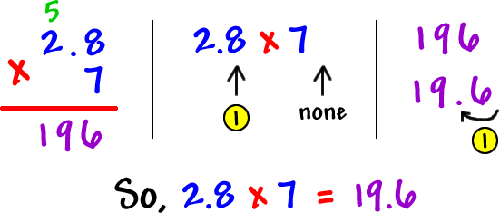

# Fractions and Decimals

> Math snippets are written with $\href{https://katex.org/}{\KaTeX}$

-   [Fractions and Decimals](#Fractions-and-Decimals)
    -   [Fractions](#Fractions)
        -   [Comparing fractions](#Comparing-fractions)
        -   [Common denominators](#Common-denominators)
        -   [Decomposing fractions](#Decomposing-fractions)
        -   [Adding fractions with like denominators](#Adding-fractions-with-like-denominators)
        -   [Subtracting fractions with like denominators](#Subtracting-fractions-with-like-denominators)
        -   [Improper fractions](#Improper-fractions)
        -   [Mixed numbers](#Mixed-numbers)
            -   [Add and subtract mixed numbers with unlike denominators](#Add-and-subtract-mixed-numbers-with-unlike-denominators)
        -   [Comparing improper fractions and mixed numbers](#Comparing-improper-fractions-and-mixed-numbers)
        -   [Adding mixed numbers](#Adding-mixed-numbers)
        -   [Subtracting mixed numbers](#Subtracting-mixed-numbers)
        -   [Multiplying fractions and whole numbers](#Multiplying-fractions-and-whole-numbers)
        -   [Converting tenths and hundredths](#Converting-tenths-and-hundredths)
        -   [Multiplying fractions with fractions](#Multiplying-fractions-with-fractions)
        -   [Multiplying mixed numbers](#Multiplying-mixed-numbers)
        -   [Fractions as division](#Fractions-as-division)
    -   [Decimals](#Decimals)
        -   [Rewriting fractions as decimals](#Rewriting-fractions-as-decimals)
        -   [Multiplying Decimals](#Multiplying-Decimals)
        -   [Developing strategies for multiplying decimals](#Developing-strategies-for-multiplying-decimals)
        -   [Division strategies for decimal quotients](#Division-strategies-for-decimal-quotients)
    -   [Common fractions and decimals](#Common-fractions-and-decimals)

## Fractions

$$
\frac{1}{2} = \frac{\text{Numerator}}{\text{Denominator}}
$$

### Comparing fractions

$$
\frac{1}{2} = \frac{2}{4} = \frac{4}{8}
$$

We can simplify fractions to see what other fractions are on the same line as another one:

`6/15` we can see that both numerator and denominator are divisible by 3, so: `2/5` are the same as `6/15`

We can do this other way to: `2/5` is the same as `4/10`. We multiply numerator and denominator by 2 and we will get an equal fraction.

> **If we have some fraction, and as long as we multiply numerator and denominator by same number we will get an equal fraction. Same with division**

$$
\frac{4}{6} = \frac{8}{12} \quad \frac{1}{5} = \frac{5}{25} \quad \frac{7}{12} = \frac{21}{36}
$$

### Common denominators

> Note: The new fractions are equal to their original form, however they are often easier to work with when the denominators are the same.

When fractions have the same denominator, we say they have common denominators. Having common denominators makes things like comparing, adding, and subtracting fractions easier.

One way to find a common denominator for two (or more!) fractions is to list the multiples of each denominator until we find the smallest multiple they have in common.

_Example:_ Find a common denominator for $\frac{7}{8}$ and $\frac{3}{10}$.

The denominators are 8 and 10. Let's list multiples of each:

-   Multiples of 8: 8,16,24,32,**40**,48,56,64,72,**80**...
-   Multiples of 10: 10,20,30,**40**,50,60,70,**80**,90,100...

40 and 80 are common multiples of 8 and 10. So, we can use either of these for a common denominator. Most often, we will use the smallest common denominator, so we can work with smaller numbers.

Now we need to rewrite $\frac{7}{8}$ and $\frac{3}{10}$ with denominator of 40:

$$ \frac{7}{8} \times \frac{5}{5} = \frac{35}{40} $$ and $$ \frac{3}{10} \times \frac{4}{4} = \frac{12}{40} $$

So, $\frac{7}{8}$ is same as $\frac{35}{40}$, and $\frac{3}{10}$ is same as $\frac{12}{40}$.

### Decomposing fractions

To decompose a number, we break it into smaller parts. For example: We can decompose 54 into 50 + 4.

Fractions, like all numbers, can be decomposed in many ways.


### Adding fractions with like denominators

Add and simplify the answer:

$$
\frac {3}{15} + \frac {7}{15} = ~?
$$

If the fraction are not a mixed numbers (don't have same denominators and wholes) and if they have the same denominator, **if you add these fractions your sum is going to have the same denominator** and the numerators are going to be the sum oof the numerator:

$$
\frac {3}{15} + \frac {7}{15} = \frac{3 + 7}{15} = \frac{10}{15}
$$

Now if we want to simplify this we're going to look for the greatest common factor in both 10 and 15, and at the first look it seems to be 5. So we can simplify this to: $\frac{2}{3}$

### Subtracting fractions with like denominators

Subtract and simplify the answer:

Subtracting fractions is very similar to adding fractions. If we have the same denominator, the denominator in difference is going to be the same as the denominator in the two numbers we're subtracting. And numerator is going to be the difference between the numerators.

$$
  \frac{8}{18} - \frac{5}{18} = \frac{8-5}{18} = \frac{3}{18}
$$

We now can simplify this to, as both numbers are divisible by 3:

$$
\frac{3 / 3}{18 / 3} = \frac{1}{6}
$$

### Improper fractions

> An improper fraction is a fraction where the numerator is greater than or equal to the denominator. Here are some examples of improper fractions: $\frac{9}{4},\frac{5}{5},\frac{7}{3}$

Improper fractions are just pure fractions where the numerator is greater than denominator. For example, this $5\frac{1}{4}$ is not a pure fraction, because we have a whole number mixed with fraction so we call this a **mixed number**. To rewrite this as an improper fraction we can multiply max pieces of fraction times whole number, $\frac{5\times4}{4} + \frac{1}{4}$ in this case. End result would be $\frac{21}{4}$

### Mixed numbers

> A mixed number is a number consisting of a whole number and a proper fraction. Here are some examples of improper fractions: $4\frac{1}{2},1\frac{3}{8},12\frac{5}{6}$

Given $\frac{7}{4}$, we can rewrite this to be a mixed number by using standard algorithm for division:

```js
  1
  ___
4/ 7  = 1 r3
   4
   --
   3
```

Which gives us result of 1 whole and 3 remainder, so $\frac{7}{4}$ can be rewritten as $1\frac{3}{4}$.

#### Add and subtract mixed numbers with unlike denominators

$$
3 \frac{4}{9} - 1\frac{1}{6} = 2 + (\frac{4}{9} - \frac{1}{6}) = 2 + (\frac{16}{36} - \frac{6}{36}) = 2 \frac{10}{36}
$$

$$
8\frac{1}{6} + 4 \frac{3}{4} = 12 + (\frac{2}{12} + \frac{9}{12}) = 2 \frac{11}{12}
$$

### Comparing improper fractions and mixed numbers

We can usually convert fraction to a mixed number here and then compare wholes. If that can't do we can convert both of them into improper fractions, find the common denominator and then do the comparison (and simplify if you want to get fancy).

### Adding mixed numbers

$$
2\frac{4}{7} + 3\frac{2}{7} = 5\frac{6}{7}
$$

$$
3\frac{3}{5} + 5\frac{4}{5} = 8\frac{7}{5} = 9\frac{2}{5}
$$

### Subtracting mixed numbers

$$
2\frac{5}{8} - 1\frac{2}{8} = 1\frac{3}{8}
$$

$$
3\frac{2}{5} - 2\frac{3}{5} = \frac{4}{5}
$$


### Multiplying fractions and whole numbers

$$
3 \times \frac{2}{5} = \frac{3 \times 2}{5} = \frac{6}{5} = 1\frac{1}{5}
$$

$$
3 \times \frac{3}{10} = \frac{3 \times 3}{10} = \frac{9}{10}
$$

### Converting tenths and hundredths

$$ \frac{8}{10} = \frac{80}{100} $$

### Multiplying fractions with fractions

$\frac{3}{5} \times \frac{1}{4} = \frac{3 \times 1}{5 \times 4} = \frac{3}{20}$


### Multiplying mixed numbers

$$
1\frac{3}{4} \times 7 \frac{1}{5} = \frac{7}{\cancel{4}^1} \times \frac{\cancel{36}^9}{9} = \frac{63}{5} = 12\frac{3}{5}
$$

> We can simplify numerators/denominators that are divisible by each other, as in above example 36 with 4. This makes multiplying a bit faster and easier.

### Fractions as division

The fraction bar and the division symbol mean the same thing, as in $1 \div 3$ is equal to $\frac{1}{3}$. We have 1 as the numerator, 3 is the denominator, and this is equal to the numerator divided by the denominator. 1 over 3 is the same thing as 1 divided by 3.

Multiplication and division are related:

$$
 \begin{aligned} \greenE{\text{number of groups}} \times \maroonD{\text{size of groups}} = \purpleD{\text{total}} \\\\ \maroonD{\text{size of groups}} \times \greenE{\text{number of groups}} = \purpleD{\text{total}} \\\\ \\\\ \purpleD{\text{total}} \div \greenE{\text{number of groups}} =\maroonD{\text{size of groups}} \\\\ \purpleD{\text{total}} \div \maroonD{\text{size of groups}} =\greenE{\text{number of groups}} \end{aligned}
$$

---

## Decimals

> Decimals are fractions, but in **base 10**. For example, `10.1` would be $10 \frac{1}{10}$. `5.2` simplified as a fraction would be $5 \frac{1}{5}$, or $5 \frac{2}{10}$.

"Decimal" comes from the Latin word _decimus_ which means 10th. We chose this name because our number system is built around the number 10, also known as a "base-10 system". You can see how important the number 10 is to our number system when you notice that each place in any number represents a value of 10.

`2.67`

All numbers to the left of the decimal are the actual numbers, like ones, tens, and hundreds. All numbers to the right of the decimal are the decimal, or even fraction, numbers, like tenths, hundredths, or thousandths. On that note, the one number to the right of the decimal, `2`, represents two wholes, which in fraction form pretty much makes it two. The two numbers to the right of the decimal, `6` and `7`, represent 67 out of `100`, or `67/100`. Add the fraction and the whole number together, and you get two and sixty-seven out of one-hundred, or `2 67/100`.

_For example_, consider the number `209,451.26301` You would read this number: Two Hundred Nine Thousand Four Hundred Fifty One Point Twenty Six Thousand Three Hundred and One Hundred Thousandths You would normally write this number: 209,451.26301 But you could also write this number:

$$
(2 \times 10^5) + (0 \times 10^4) + (9 \times 10^3) + (4 \times 10^2) + (5 \times 10^1) + (1 \times 10^0) + (2 \times 10^-1) + (6 \times 10^-2) + (3 \times 10^-3) + (0 \times 10^-4) + (1 \times 10^-5)
$$

Or

$$
200,000 + 0 + 9,000 + 400 + 50 + 1 + 0.2 + 0.06 + 0.003 + 0.0 + 0.00001
$$

Notice that every digit within this number is multiplied by a different power of 10. **That is true of all numbers.**


### Rewriting fractions as decimals

Write $\frac{29}{100}$ as a decimal:

$$
\frac{29}{100} = \frac{2\cancel{0}}{10\cancel{0}} + \frac{9}{100} = \frac{2}{10} + \frac{9}{100} = \textrm{2 tenths + 9 hundredths} = 0.29
$$

Write $\frac{53}{10}$ as a decimal:

$$
\frac{53}{10} = \frac{5\cancel{0}}{1\cancel{0}} + \frac{3}{10} = \frac{5}{1} + \frac{3}{10} = \textrm{5 ones + 3 tenths} = 5.3
$$

### Multiplying Decimals

There's a bit of a silly trick to multiplying decimals. It's not really a trick -- it's just how it works -- but, it's so weird that it may seem like a trick. Here's the deal:

1. Ignore the decimal points and multiply as usual...
2. Count how many total digits are on the right side of the decimal points in numbers you are multiplying
3. Place the decimal point in your answer so there are this many digits to the right.

For example, we can $2.8 \times 7$ calculate as $28 \times 7$:



Here's another one: $3.1 \times 5.9$

Before we get into it, what should our answer be close to? Do some rounding... 3 x 6 = 18... So, our answer should be around 18!

Multiply... Count the spots behind the decimals... Put the decimal point in your answer:


Another technique for multiplying decimals:

Let's say that we want to multiply $9 \times 0.6$. We can simplify this a bit by reasoning that $0.6 = 6 / 10$ which means that $0.6$ is the same thing as `6` divided by `10`. Dividing by `10` is equivalent to moving the decimal place one place to the left, so `6.0` becomes `0.60`. What we can do now when multiplying $9 \times 0.6$ is to set up our calculation like this:

$$
9 \times 0.6 = \underbrace{(9 \times 0.6) / 10}_{54 / 10} = 5.4
$$

Some examples:

$$
0.1 \times 0.5 = \frac{1}{10} \times \frac{5}{10} = \frac{1 \times 5}{10 \times 10} = \frac{5}{100} = 0.05
$$

$$
0.2 \times 0.8 = \frac{2}{10} \times \frac{8}{10} = \frac{2 \times 8}{10 \times 10} = \frac{16}{100} = 0.16
$$

$$
0.8 \times 0.9 = \frac{8}{10} \times \frac{9}{10} = \frac{8 \times 9}{10 \times 10} = \frac{72}{100} = 0.72
$$

$$
0.8 \times 7 = (8 \times 7) / 10 = 56  / 10 = 5.6
$$

$$
5 \times 0.25 = (5 \times 25) / 100 = 125 / 100 = 1.25
$$

$$
5 \times 0.75 = (5 \times 75) / 100 = 375 / 100 = 3.75
$$

$$
4 \times 0.43 = (4 \times 43) / 100 = 172 / 100 = 1.72
$$

$$
0.4 \times 0.62 = \frac{4}{10} \times \frac{62}{100} = \frac{4 \times 62}{10 \times 100} = \frac{248}{1000} = 0.248
$$

$$
7.7 \times 0.7 = \frac{77}{10} \times \frac{7}{10} = \frac{77 \times 7}{10 \times 10} = \frac{539}{100} = 5.39
$$

$$
1.2 \times 7.7 = \frac{12}{10} \times \frac{77}{10} = \frac{12 \times 77}{10 \times 10} = \frac{924}{100} = 9.24
$$

$$
3.1 \times 3.4 = \frac{31}{10} \times \frac{34}{10} = \frac{31 \times 34}{10 \times 10} = \frac{1054}{100} = 10.54
$$

### Developing strategies for multiplying decimals

There are multiple strategies for multiplying decimals beside the **standard strategy**, here is a few examples of how we can multiply decimals by using several strategies.

Let's say that we want to multiply $3 \times 0.25$. We can calculate this:

Strategy one:

$$
3 \times 0.25 = (3 \times 25) / 100 = 75 \ 100 = 0.75
$$

Strategy two:

$$
3 \times 0.25 = 3 \times \frac{25}{100} = \frac{3 \times 25}{100} = \frac{75}{100} = 0.75
$$

### Division strategies for decimal quotients

`3 / 2`:

$$
3 / 2 = \frac{3}{2} = \frac{2 + 1}{2} = \cancel{\frac{2}{2}} + \frac{1}{2} = 1\frac{1}{2}= 1\frac{5}{10}= 1.5
$$

$$
30 \textcolor{#228B22}{tenths} / 2 = 15 \textcolor{#228B22}{tenths} = 1.5
$$

`34 / 4`:

$$
\frac{34}{4} = 8\frac{2}{4} = 8\frac{5}{10} = 8.5
$$

`8.4 / 7`:

$$
84\textcolor{#228B22}{tenths}  / 7 = 12 \textcolor{#228B22}{tenths} = 1.2
$$

$$
\frac{84}{10} \div 7 = \frac{84}{10} \times \frac{1}{7} = \frac{84}{10 \times 7} = \frac{\cancel{84} \space 12}{10 \times \cancel{7} \space 1} =  \frac{12}{10} = 1.2
$$

`2.5 / 5`:

$$
2.5 \div 5 = \frac{25}{10} \times \frac{1}{5} = \frac{25}{10 \times 5} = \frac{\cancel{25} \space 5}{10 \times \cancel{5} \space 1} = \frac{5}{10} = 0.5
$$

`0.56 / 7`:

$$
0.56 \div 7 = \frac{56}{100} \times \frac{1}{7} = \frac{56}{100 \times 7} = \frac{\cancel{56}\space 8}{100 \times \cancel{7} \space 1} = \frac{8}{100} = 0.08
$$

`7 / 70`:

$$
\frac{7}{7 \times 10} = \frac{\cancel{7} \space 1}{\cancel{7} \space 1 \times 10} = \frac{1}{10} = 0.1
$$

$$
7 \div (7 \times 10) =  7 \div 7 \div 10 = 1 \div 10 = 0.1
$$

`9 / 30`:

$$
9 \div 30 = 9 \div (3 \times 10) = (9 \div 3) \div 10 = 3 \div 10 = 0.3
$$

$$
9 \div 30 = \frac{9}{3 \times 10} = \frac{\cancel{9} \space 3}{\cancel{3} \space 1 \times 10} = \frac{3}{10} = 0.3
$$

`7.8 / 60`:

$$
7.8 \div 60 = 7.8 \div 6 \div 10 = (7.8 \div 6) \div 10 = 1.3 \div 10 = 0.13
$$

`50 / 40`:

$$
50 \div 40 = \frac{50}{40} = \frac{5 \times 10}{4 \times 10} = \frac{5}{4} \times \frac{10}{10} = 1.25 \times 1 = 1.25
$$

`3000 / 400`:

$$
3000 \div 400 = \frac{3000}{400} = \frac{3 \times 1000}{4 \times 100} = \frac{3}{4} \times \frac{1000}{100} = 0.75 \times 10 = 7.5
$$

`30 / 1000`:

$$
30 \div 1000 = \frac{30}{1000} = \frac{3}{1} \times \frac{10}{1000} = 3 \times \frac{1}{100} = \frac{3}{100} = 0.03
$$

`0.8 / 0.2`:

There are many ways to solve this problem:

$$
0.8 \div 0.2 = 8\space\textcolor{#228B22}{tenths} \div 2\space\textcolor{#228B22}{tenths} = 4
$$

$$
0.8 \div 0.2 = \frac{0.8}{0.2} = \frac{0.8 \times 10}{0.2 \times 10} = \frac{8}{2} = 4
$$

`0.72 / 0.08`:

$$
0.72 \div 0.08 = \frac{0.72}{0.08} = \frac{72 \times 100}{8 \times 100} = \frac{72}{8} = 9
$$

`12 / 0.5`:

$$
12 \div 0.5 = 120\space\textcolor{#228B22}{tenths} \div 5\space\textcolor{#228B22}{tenths} = 24
$$

$$
12 \div 0.5 = \frac{12}{0.5} = \frac{12 \times 10}{0.5 \times 10} = \frac{120}{5} = 24
$$

`4.2 / 0.3`:

$$
4.2 \div 0.3 = \frac{4.2}{0.3} = \frac{42 \times 10}{3 \times 10} = \frac{42\cancel{0}}{3\cancel{0}} = \frac{42}{3} = 14
$$

`4.5 / 0.15`:

$$
4.5 \div 0.15 = 450\space\textcolor{blue}{hundredths} \div 15\space\textcolor{blue}{hundredths} = 30
$$

$$
4.5 \div 0.15 = \frac{4.5}{0.15} = \frac{4.5 \times 100}{0.15 \times 100} = \frac{450}{15} = 30
$$

---

## Common fractions and decimals

Some fractions are so common that it's worth memorizing the decimal form. Here are a few of the most common fractions and their decimal forms:

$\frac{1}{2} = 0.5$ $\frac{1}{4} = 0.25$ $\frac{1}{5} = 0.2$

We can use these three common fractions to convert other fractions to decimals and decimals to fractions.
