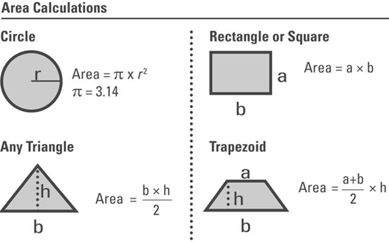

# Geometry

[[toc]]

[TOC]

---

## Area and perimeter

```
              d
        |-----------|
      c |           |
        |-----------|
```

**Area** is the space inside of a two-dimensional shape. We can also think of area as the amount of space a shape covers.

**Oblast(Area)** predstavlja celo područje unutrašnjeg dela geometrijske figure, mereno u jedinicama. Oblast pravougaone figure je definisan proizvod dve strane, i moze se izračunati uz pomoć sledeće formule: $$O = d * c$$

$$ height \times width = area $$

**Perimeter** is the distance around the outside of a two-dimensional shape.To find the perimeter of a shape, we add all of the shape's side lengths.

**Perimetar** je distanca potrebna da se obidje oko nekog objekta, ili matematički rečeno zbir svih strana geometrijske figure. Može se izračunati uz pomoć sledeće formule: $$P = (d *c)* 2$$ $$ (height \times width) \times 2 = perimeter $$

### Area formulas



## Lines

A **line** extends forever in both directions, like this:


A **line segment** is just part of a line. It has two endpoints, like this:


A **ray** starts at one point and continues on forever in one direction, like this:


**Perpendicular lines** are lines that meet at right angles.


Parallel lines are always the same distance apart from each other — no matter how far they are extended, they will never meet.


## Angles

An angle is two rays that share a vertex. Intersecting lines or line segments also form angles.

### Measuring angles

Angles are measured in degrees. The wider an angle is open, the greater its measure.

## Angle types

| Angle type | Angle size (in degrees)              |
| ---------- | ------------------------------------ |
| Acute      | Between $0\degree$ and $90\degree$   |
| Right      | Exactly $90\degree$                  |
| Obtuse     | Between $90\degree$ and $180\degree$ |
| Straight   | Exactly $180\degree$                 |

A **right angle** is a 90degree angle. A right angle is in the shape of a perfect corner, like the corner of a rectangular sheet of paper.

A **straight angle** is a 180 degree angle. A straight angle looks like a straight line.

An **acute angle** is an angle whose degree measure is less than 90 degree.

An **obtuse angle** is an angle whose degree measure is greater than 90 degree but less than 180 degree.

## Triangle types

> All of the internal angles of a triangle equal 180 degrees.

An **scalene** triangle is a triangle where none of the sides are equal.

An **isosceles** triangle is an angle where we have at least two sides that have same length.

An **equilateral** triangle is an triangle where all three sides have same length.

An **acute** tringle is the triangle where all of the angles have less than 90$\degree$.

An **right** is a triangle that have an angle that is exactly 90$\degree$.

An **obtuse** triangle is a triangle that have an angle that is larger than 90$\degree$.

## Symmetry

An shape is symmetrical if it has at least one line of symmetry.

The _line of symmetry_ is the imaginary line where you could fold the image and have both halves match exactly.

## Quadrilaterals

> A quadrilateral is a polygon with four sides.


**Parallelogram** is a quadrilateral where opposite sides are parallel - going in the same direction:


**Rhombus** is a type of parallelogram - the opossite sides have to be parallel and all sides must be equal.


> Square is a rhombus

**Rectangle** is kind of parallelogram where all the corners are the right angles.


**Square** is a parallelogram, rhombus and rectangle.

---

### Quadrilateral Summary

| Name          | Definition                       |
| ------------- | -------------------------------- |
| Quadrilateral | 4 sided closed figure            |
| Parallelogram | 2 pairs of parallel sides        |
| Trapezoid     | Exactly 1 pair of parallel sides |
| Rectangle     | 4 right angles                   |
| Rhombus       | 4 equal sides                    |
| Square        | 4 equal sides and 4 right angles |

---

## Volume

Volume is the amount of 3-dimensional space an object occupies and it is measured in cubic units.

### Volume formulas


#### How to use the volume formulas to calculate the volume

-   **Cube (Square)**

Given that the length of a side = a = 2 cm:

$$
Volume = (a) = 2cm × 2cm × 2cm = 8cm^3
$$

-   **Cylinder**

Given that the height is 8 inches and the radius is 2 inches:

$$
Volume = \pi × r^2 × h = 3.14 × (2 in)^2 × 8 in = 3.14 × 4 × 8 in^3 \\
Volume = 3.14 × 32 in^3 = 100.48 in^3
$$

-   **Rectangular solid or cuboid**

Given that the length is 6 cm, the width is 3 cm and the height is 5 cm:

$$
Volume = l × w  × h =  6 × 3 × 5 = 90 cm^3
$$

-   **Sphere**

Given that the radius = r = 20:

$$
Volume = (4 × π × r^3)/3 = [4 × 3.14 × (20)^3]/3 = 3.14 × (20)^3 × 4 \\
Volume = 3.14 × 8000 × 4 = 3.14 × 32000 = 100480
$$

-   **Cone**

Given that the radius is equal to 3 and the height is equal to 4:

$$
Volume = (π × r^2 × h)/3 = [3.14 × (3)^2× 4]/3 = 3.14 × 9 × 4 \\
Volume = 3.14 × 36 = 113.04
$$

-   **Pyramid**

Given that the pyramid has a height of 6 feet. If the base of a pyramid is a square with a length of 2 feet, find the volume.

$$
Volume = (B × h)/3 \\
B = \text{area of base}  = 2 ft × 2 ft = 4 ft^2 \\
Volume = (4 × 6)/3 ft^3 = 24/3 ft^3 = 8 ft^3
$$

-   **Ellipsoid**

Given that the radii of an ellipsoid are 1 cm, 2, cm, and 3 cm.

$$
Volume = (4 × π × a × b × c)/3 = (4 × 3.14 × 1 × 2 × 3)/3 \\
Volume = ( 3.14 × 4 × 6)/3 = ( 3.14 × 24)/3 = 81.64/3 = 25.12 cm^3
$$

-   **Hollow cylinder**

The outer radius is 8, the internal radius is 6, and the height is 10.

$$
Volume = π × h ( R^2 - r^2) = π × 10 ( 8^2 - 6^2) = π × 10 ( 64 - 36) \\
Volume = π × 10(28) = π × 280 = 879.2
$$

## Coordinate Plane

A coordinate plane is a two-dimensional plane formed by the intersection of a vertical line (usually) called y-axis and a horizontal line (usually) called x-axis. These are perpendicular lines that intersect each other at zero, and this point is called the **origin**. The axes cut the coordinate plane into four equal sections, and each section is known as quadrant.


> The two-dimensional plane is called the **Cartesian plane**, or the coordinate plane and the axes are called the coordinate axes or x-axis and y-axis.

### Graphing coordinates

For graphing coordinates we are using ordered pairs (x, y), where x represents the point on the x-axis and y a point on the y-axis.

### Quadrants

The original intersecting number lines are dividing the coordinate plane into four areas, called quadrants. These are numbered, by tradition, using Roman numerals in a counterclockwise direction starting with the top, right quadrant, called Quadrant I.

-   Quadrant I: This is the quadrant with only positive values for both the x-axis and y-axis. $(x,y)$
-   Quadrant II, to its left, has negative x values and positive y values. $(-x,y)$
-   Quadrant III has both negative x and y values. $(-x,-y)$
-   Quadrant IV has negative y values and positive x values. $(x,-y)$

Nothing prevents a line or flat shape from starting in one quadrant and continuing into another. A circle, for example, could have a center at, say, (1, 3) and a radius of 10 units, allowing it to sweep through all four quadrants.

### Intercept

When a line crosses either the x-axis or y-axis, the point is called either the **x-intercept** or **y-intercept**. An intercept always happens when the value of the crossed axis is o:

[insert coordinate plane with straight line intercepting at (5, 0) and (0, 3); label both points with each coordinate pair]

Here the line intercepts the y-axis at 3, along the x-axis value of 0, and intercepts the x-axis at 5, along the y-axis value of 0.
