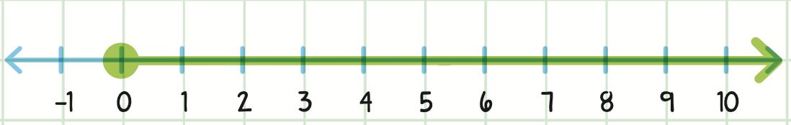

# Negative Numbers and Inequalities

[[toc]]

[TOC]

---

## Negative Numbers

### Absolute values

Opposite of a number is the number that is the same distance from the zero, but on the other side of it.

For example: opposite of 3 is -3, of the 5 is -5, 72 is -72 and so on...

One way to think about it is that the number will have the same absolute value but different sign.

Example:

Find |x| when $x = 5$, $x = -10$ and $x = -12$.

> |x| (pipes) are the notation for the absolute values. Absolute value bars are also grouping symbols, so you must complete the operation inside them first, then take the absolute value.

$$
|5| = 5, |-10| = 10, |-12| = 12
$$

> The **absolute value** is just the number's distance from the zero.

$$
|5| = 5\enspace abs\enspace of\enspace 5\enspace is\enspace 5.
$$

$$
|-10| = 10\enspace abs\enspace of\enspace -10\enspace is\enspace 10.
$$

---

#### Calculating value as the distance between the numbers

<----a------b---->

<----b------a---->

$|a-b| = |b-a|$ or:

$$
|-2-3| = |-5| = 5
$$

$$
|3-(-2)| = | 5 | = 5
$$

### Negative numbers addition

> Subtracting a positive is the same as adding a negative.

$$
15 + (-46) + 29 = -2
$$

$$
-15-46-29 = -90
$$

$$
\begin{aligned}
6 + (-3) = 3 \\
\text{we could write this as:} \\
(+6)+(-3)=(+3)
\end{aligned}
$$

### Adding & subtracting negative fractions

$$
\begin{aligned}
	-\frac{5}{8}-(-\frac{4}{3})= -\frac{5}{8}+\frac{4}{3}=\frac{15}{24}+\frac{32}{24}=\frac{17}{24}
\end{aligned}
\tag{1}
$$

$$
\begin{aligned}
	\frac{8}{6}+(-\frac{9}{5})=\frac{8}{6}-\frac{9}{5}=\frac{40}{30}-\frac{54}{30}=-\frac{14}{30}=-\frac{7}{15}
\end{aligned}
\tag{2}
$$

$$
\begin{aligned}
	-\frac{3}{2}-\frac{3}{8}=-\frac{12}{8}-\frac{3}{8}=-\frac{15}{8}
\end{aligned}
\tag{3}
$$

$$
\begin{aligned}
	f +\frac{1}{4}&=-\frac{7}{2} \\
	\text{To isolate } f \text{, we substract }&\frac{1}{4} \text{ from both sides} \\
	f + \frac{1}{4}-\frac{1}{4}&=-\frac{7}{2}-\frac{1}{4} \\
	f &= -\frac{14}{4}-\frac{1}{4} \\
	f &= -\frac{15}{4}
\end{aligned}
\tag{4}
$$

### Multiplying negative numbers

-   Multiplying negative with negative always yields a positive value. $-2\times(-3)=6$
-   Multiplying negative with positive always yields a negative number.$-2\times 3=-6$

Also:

-   If there are an odd number of negative numbers, the result is NEGATIVE.
-   If there are an even number of negative numbers, the result is POSITIVE.

### Dividing negative numbers

-   Dividing negative with negative always yields a positive value. $-6\div(-2)=3$
-   Dividing negative with positive always yields a negative number.$−6\div2=−3$

---

## Inequalities

> Inequalities show the relation between two expressions that are not equal.

An inequality is a mathematical sentence that is used to compare quantities and contains one of the following signs: $\lt, \gt, \not=, \leq, \geq$.

> Just like when we add or subtract fractions with different denominators, we have to make the denominators the same when comparing fractions.

Equations and inequalities are both mathematical sentences formed by relating two expressions to each other. In an equation, the two expressions are deemed equal which is shown by the symbol = as in $x=y$.

In an inequality, the two expressions are not necessarily equal which is indicated by the symbols: >, <, ≤ or ≥, as in $x > y$ or $x \geq y$

An equation or an inequality that contains at least one variable is called an **open sentence**. When you substitute a number for the variable in an open sentence, the resulting statement is either true or false. If the statement is true, the number is a solution to the equation or inequality.

### Compound inequalities

A compound inequality consists of two or more inequalities. There are two types of compound inequalities: compound inequalities joined by the word "and" and compound inequalities joined by the word "or."

Example:

$$
-6 \lt x \leq 2
$$

This can be written as following:

$$
x \gt -6 \text{ and } x \leq 2
$$

Compound inequalities joined by "and" are also called the "**intersection**" of two inequalities.

To solve compound inequalities joined by the word "and," apply the rules for inequalities to all sides of the compound inequality. If you multiple or divide the compound inequality by a negative number, you will need to flip all the inequality signs.

Example:

$$
\begin{aligned}
	3 \leq -6x& + 9 \lt 6 \\
	-6 \leq -6&x \lt -3 \\
	1 \geq x& \gt \frac{1}{2} \\
	\frac{1}{2} \lt x& \leq 1
\end{aligned}
$$

---

$$
x \lt -4 ; x \geq -1
$$

This can also be written as the following:

$$
x \lt -4 \text{ or } x \geq -1
$$

Compound inequalities joined by "or" are also called the "**union**" of two inequalities.

To solve compound inequalities joined by the word "or," solve each inequality separately. Treat each inequality as its own singular inequality, determine the result of the individual inequalities, then combine the results.

Example:

$$
\begin{alignedat}{2}
	-4x+5 \lt 13& \text{ or } &-2x - 8 \geq 4 \\
	   -4x \lt 8& 			  &-2x \geq 12 \\
	   x \leq -6& 			  &x \gt -2
\end{alignedat}
$$

### Solving inequalities

To solve inequalities, you can apply most of the same principles used when solving equations. When solving inequalities, nothing changes when adding, subtracting, or multiplying and dividing by a positive number. As with equations, when we add or subtract the same number on both sides of the truth of the inequality doesn't change.

This holds true for all numbers:

-   $x\gt y\rarr x\lt y\rarr$
-   $x+z\gt y+z\rarr x+z\lt y+z\rarr$
-   $x-z\gt y-zx-z\lt y-z$

Example:

-   $x+3\gt9$
-   $x+3-3\gt9-3$
-   $x\gt6$

---

It is a little bit trickier when it comes to division and multiplication. When we multiply or divide an inequality by a positive integer, the truth of the inequality doesn't change:

-   $x\gt y\rarr$
-   $x\cdot z\gt y\cdot z\rarr$
-   $\frac{x}{z} \gt \frac{y}{z}$
-   $If \hspace{0.1em}z \gt 0$

But, **when we multiply or divide an inequality by a negative integer, the sign of the inequality will be reversed (changed)**:

-   $x\gt y\rarr$
-   $x\cdot z\lt y\cdot z\rarr$
-   $\frac{x}{z} \lt \frac{y}{z}$
-   $If \hspace{0.1em}z \lt 0$

Example:

-   $\frac{x}{-2} \geq 3$
-   $\frac{x}{-2}\cdot -2 \geq 3 \cdot -2$
-   $x \leq -6$
-   Solve $2-3x \lt 14$:
    -   We can treat this just like a normal algebra equation, but we need to keep in mind that when we multiply or divide by a negative number we need to flip around $\lt$ to $\gt$, the inequality has to change a sign.
    -   We can start by subtracting 2 from both sides, which results in: $-3x \lt 12$
    -   At this point we're going to divide by the negative 3, but we need to be very careful, because when we're dividing or multiplying by a negative number, inequality changes sign: $\frac{\cancel{-3}x}{\cancel{-3}}\lt \frac{12}{-3}=x \gt -4$
-   Solve $x+2 \leq 2x$:
    -   $x+2 \leq 2x=x+2-2 \leq 2x -2 = x \leq x$
-   Solve $3x +4 \gt 5x$:
    -   $3x +4 -4 \gt 5x -4 = 3x \gt 1x$

### Inequalities involving polynomials

When solving inequalities involving polynomials, you need to simplify the inequality so that one side equals zero. This is similar to the format of a quadratic equation $ax^2 + bx + c =0$. By setting one side of the inequality equal to zero, you create a relationship where the solution to the inequality depends on the zeros of the polynomial.

### Solving and Graphing Inequalities

While an equation is a mathematical sentence that contains an equal sign, an _inequality_ is a mathematical sentence that contains a sign indicating that the values on each side of it are **not** equal.

To solve an inequality, just follow the same steps as solving an equation.

$$
\begin{aligned}
	5x + 6 &< 21 \\
	&\text{[Subtract 6 from both sides.]} \\
	5x \cancel{+6}\cancel{-6} &< 21 - 6 \\
	&\text{[Divide to get the variable alone.]} \\
	\frac{\cancel{5}x}{\cancel{5}}&< \frac{15}{5} \\
	x &< 3
\end{aligned}
$$

But, again, there’s only one difference: any time you multiply or divide by a negative number, you must reverse the direction of the inequality sign.

$$
\begin{aligned}
	-4x &\geq 24 \\
	\text{Divide to get the variable alone, but also reverse the inequality sign} \\
	\frac{\cancel{-4}x}{\cancel{-4}} &\leq \frac{24}{-4} \\
	x &\leq -6
\end{aligned}
$$

The answer to any inequality is an infinite set of numbers. (The answer x ≤ −6 _literally_ means _any_ number less than or equal to −6, which can go on forever!) But we can still represent this set of numbers with inequality symbols.

---

In addition to writing inequalities using symbols, we can _graph inequalities_ on a number line as well. Here are the different ways to graph inequalities:

$x \lt 8$:

The number represented by $x$ is less than $8$, so $8$ is _not_ included in the possible numbers. Therefore, the circle is open.

> If the sentence uses a ≤ or ≥ sign, we indicate this with a _closed circle_ to indicate that the solutions could equal the number itself.

$x \geq 0$:

Because $x$ is greater than or equal to $0$, $0$ is included in the possible numbers. Therefore, the circle is closed.

### Word problems with equations and inequalities

In word problems, look for key words:

-   _is_ usually means $=$
-   _is greater than_ usually means $>$
-   _is less than_ usually means $<$
-   _at least_ usually means $≥$
-   _at most_ usually means $≤$
