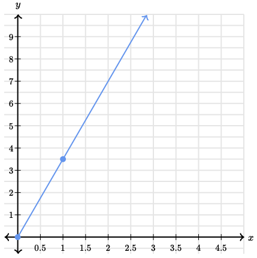
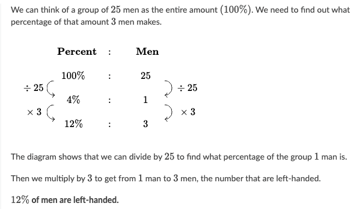

# Ratios, rates, & percentages

[[toc]]

[TOC]

---

## Ratio

> The numbers or measurements being compared are called the terms of the ratio.

A _ratio_ is a comparison of two quantities. For example, you might use a ratio to compare the number of students who have cell phones to the number of students who don’t have cell phones. A ratio can be written in a few different ways, for example, the ratio 3 to 2 can be written as:

-   $3:2$
-   $\frac{3}{2}$
-   3 to 2

The ratio is 2 to 5 or 2:5 or 2/5. All these describe the ratio in different forms of fractions. The ratio can consequently be expressed as fractions or as a decimal. 2:5 in decimals is 0.4.

> Order matters in ratios!

_Some Examples:_

-   Thea has 6 pieces of granite, 21 pieces of marble, 12 pieces of sandstone, and 11 piece of slate. _What is the ratio of pieces of sandstone to pieces of marble in Thea's collection?_ Answer: **12:21**

We can simplify the answer further, as both numbers are divisible by 3, thus simplified answer would be **4:7**, or ,in words, four for every seven.

-   If 5 kgs of avocados cost 9 dollars, what is the cost for 1 kg of avocados? - So, the ratio here is $5:9$, and to calculate how much one kg costs we can simplify this: $5:9=1:\frac{9}{5},9\div5=\frac{9}{5}=1\frac{4}{5}=1.8$ So the answer is 1.8\$.

### Ratio tables

A ratio table gives a bunch of equivalent ratios.

Example:

Ben drinks 1 glass of milk for every 2 cookies he eats:

| milk | cookies |
| ---- | ------- |
| 1    | 2       |

We can expand further:

| milk | cookies |
| ---- | ------- |
| 1    | 2       |
| 2    | 4       |

Notice that both ratios in the ratio table are equivalent: $\frac{1}{2}=\frac{2}{4}$

| milk | cookies |
| ---- | ------- |
| 1    | 2       |
| 2    | 4       |
| 3    | 6       |
| 4    | 8       |
| ...  | ...     |

$\frac{1}{2}=\frac{2}{4},\frac{2}{3}=\frac{4}{6}, \frac{3}{4}=\frac{6}{8}$

### Rate

A _rate_ is a special kind of ratio where the two amounts being compared have different units. For example, you might use rate to compare 3 cups of flour to 2 teaspoons of sugar. The units (cups and teaspoons) are different.

If we have a multiple-unit rate such as 120 students for every 3 buses, and want to find the single-unit rate, we can write a ratio equal to the multiple-unit rate with 1 as the second term. A _unit-rate_ is a rate that has 1 as its denominator. To find a unit rate, set up a ratio as a fraction and then divide the numerator by the denominator.

$$
120/3 = 40/1
$$

The unit rate of 120 students for every 3 buses is 40 students per bus. You could also find the unit rate by dividing the first term of the ratio by the second term.

When prices are expressed as a quantity of 1, such as $25 per ticket or $0.89 per can, they are called **unit prices**. If we have a multiple-unit price, such as \$5.50 for 5 pounds of potatoes, and want to find the single-unit price, divide the multiple-unit price by the number of units.

$$
\$5.50 \div 5 = \$1.10
$$

> When you're calculating unit price, be sure to put the price in the numerator!

The unit price of potatoes that cost \$5.50 for 5 pounds is \$1.10 per pound.

> Rates and unit rates are used to solve many real-world problems. Also a lot of theory in Algebra nad Calculus depends on rates, which is why it's important to learn how they work.

_Some examples:_

-   At the market, 8 batteries cost 10\$. How much do 6 batteries cost?
    -   $8:10=(8/8):(10/8)=1:\frac{10}{8}=1:\frac{5}{4}=1:1\frac{1}{4}=1:1.25\newline6 \times 1.25=7.50$

#### Rates with fractions

An athlete can swim $\frac{1}{2}$ mile every $\frac{1}{3}$ hour. What is the unit rate of the athlete?

$$
\frac{1}{2}mile \div \frac{1}{3}hour = \frac{\frac{1}{2}}{\frac{1}{3}} = \frac{1}{2} \cdot \frac{3}{1}=\frac{3}{2} = 1\frac{1}{2}mph
$$

Person drinks $3\frac{1}{2}$ liters of tea every $\frac{2}{3}$ of an hour at constant rate. How many liters of tea they drink in one hour?

$$
\begin{aligned}
	&\frac{3\frac{1}{2} \ liters}{\frac{2}{3} \ hours} \cr
	=& 3\frac{1}{2}\div\frac{2}{3} \cr
	=& \frac{7}{2}\div\frac{2}{3}\cr
	=& \frac{7}{2}\cdot\frac{3}{2}\cr
	=& \frac{21}{4} \text{liters per hour}
\end{aligned}
$$

### Proportions

A _proportion_ is a number sentence where two ratios are equal. For example, someone cuts a pizza into 2 equal pieces and eats 1 piece. The ratio of pieces that person ate to the original pieces of pizza is $\frac{1}{2}$. The number $\frac{1}{2}$ is the same ratio as if that person instead cut the pizza into 4 equal pieces and ate 2 pieces. $\frac{1}{2} = \frac{2}{4}$

We can check if two ratios form a proportion by using cross products. To find cross products, set the two ratios next to each other, then multiply diagonally. If both products are equal to each other, then the two ratios are equal and form a proportion.

$$
\begin{aligned}
	&\frac{1}{2}:\frac{2}{4} \\
	&1 \cdot 4 = 4 \\
	&2 \cdot 2 = 4 \\
	&4=4
\end{aligned}
$$

Two ratios that form a proportion are called **equivalent fractions**. For example, $\frac{3}{5}$ and $\frac{9}{15}$ are equivalent fractions because their cross products are equal.

You can also use a proportion to _find an unknown quantity_. For example, you are making lemonade, and the recipe says to use 5 cups of water for every lemon you squeeze. How many cups of water do you need if you have 6 lemons?

1. set up a ratio: $\frac{5 \ cups}{1 \ lemon}$
2. set up a ratio for what you are trying to figure out. Because you don't know how many cups are required for 6 lemons, use x for the amount of water. $\frac{x \hspace{0.05em} \ cups}{6 \ lemons}$
3. set up a proportion by setting the ratios equal to each other (cross multiplication):

$$
\begin{aligned}
	\frac{5 \text{ cups}}{1 \text{ lemon}} &: \frac{x \text{ cups}}{6 \text{ lemons}} \\
	1 \cdot x &= 5 \cdot 6 \\
	1 \cdot x &= 30 \\
	x &= 30
\end{aligned}
$$

Sometimes, a proportion stays the same, even in different scenarios. For example, Tim runs $\frac{1}{2}$ a mile, and then he drinks 1 cup of water. If Tim runs 1 mile, he needs 2 cups of water. If Tim runs 1.5 miles, he needs 3 cups of water (and so on). The proportion stays the same, and we multiply by the same number in each scenario (in this case, we multiply by 2). This is known as the **constant of proportionality** or the **constant of variation** and is closely related to unit rate (or unit price). Another way to think about them is that, in a proportional relationship, one variable is always a constant value times the other.

-   Five out of every eight albums that Latrell owns are jazz. What percentage of his music collection is jazz?

$$
\begin{aligned}
	&\frac{5}{8} = 5 \div 8 = 0.625 \\
	&\text{(Move the decimal two spaces to the right and include a percent sign.)} \\
	&0.625 \times 100 = 62.5\%
\end{aligned}
$$

We can solve this problem by using proportions:

$$
\begin{aligned}
	&\frac{5}{8}:\frac{x}{100} \\
	&\text{(Divide both sides by 8 so you can get x alone.)} \\
	&8 \cdot x = 5 \cdot 100 \\
	&x = 62.5
\end{aligned}
$$

An example of non-proportional relation:

| # of servings | cost per cake | serving:cost |
| ------------- | ------------- | ------------ |
| 10            | $20           | 10:20        |
| 20            | $30           | 20:30        |
| 30            | $40           | 40:40        |

As we can see, when we increase number of servings by double, the cost is not following the same rules - we 're multiplying number of servings by 2, but the cost is increasing by 1.5 in first step, and $1\frac{1}{3}$ in the second step. When we're multiplying our servings by some amount, we're not multiplying cost by the same amount, and because of that, this relation is not proportional.

#### Constant of Proportionality

The constant value (often written $k$) relating amounts that rise or fall uniformly together. The constant ratio in a proportional relationship is called the constant of proportionality, denoted by $k$. The constant of proportionality is also known as **unit rate**.

-   If two quantities x and y are directly proportional, their relationship can be defined by the formula $y=kx$.
-   If two quantities x and y are indirectly proportional, their relationship can be defined by the formula $y=\frac{k}{x}$.

where $k$ is the constant of proportionality.

**Example**: you are paid \$20 an hour. The constant of proportionality is 20 because: Pay = 20 $\times$ Hours worked.

**Example.** Ellie decided to buy a new model of a car. The car can go 150 miles with 25 liters of fuel. Ellie wonders how far it can go with 30 liters of fuel.

| Distance, $y$ (in miles)  | 25  | 30  |
| ------------------------- | --- | --- |
| **Fuel, $x$ (in liters)** | 150 | ?   |

As the quantity of fuel increases, the distance covered by the car also increases. Thus, this is a case of _direct proportion_.

The variables $x$ and $y$ are related as: $y=kx$, where $k$ is the constant of proportionality.

Substitute $x=150$ and $y=25$ to find the constant of proportionality, $k$.

$$
\begin{aligned}
	25 &= k \times 150 \cr
	25 &= 150k \cr
	k &= \frac{25}{150} \cr
	k &= \frac{1}{6}
\end{aligned}
$$

Now, let's find the distance the car can cover with 30 liters of fuel by substituting $k = \frac{1}{6}$ and $y=30$:

$$
\begin{aligned}
	30 &= \frac{x}{6} \cr
	x &= 30 \times 6 \cr
	x &= 180
\end{aligned}
$$

Thus, the car can go 180 miles with 30 liters of fuel.

#### Graphing constant of proportionality

What is the constant of proportionality between $y$ and $x$ in the graph?

If the constant of proportionality of a proportional relationship is $k$, then:

$$
y = kx
$$

Let's pick a point on the graph to get the $x$ and $y$ values. Then we can solve for $k$. If we pick $(6,6)$, then $6 = k \cdot 6$. If we divide both sides of the equation to solve for $k$, we get:

$$
\begin{aligned}
	\frac{6}{6}&=\frac{k\cdot\cancel{6}}{\cancel{6}} \cr
	1 &= k
\end{aligned}
$$

We can say that the constant of proportionality between $y$ and $x$ in the graph above is $1$.

**Example.** What is the constant of proportionality, $\frac{y}{x}$?

$$
\begin{aligned}
	y &= kx \cr
	3.5 &= k \cdot 1\cr
	\frac{3.5}{1}&=\frac{k \cdot \cancel{1}}{\cancel{1}}	\cr
	3.5 &= k
\end{aligned}
$$

#### Constant of proportionality from equation

What is the constant of proportionality in the equation $4y=8x$?

$$
\begin{aligned}
	4y&=8x \cr
	\frac{\cancel{4}y}{\cancel{4}} &= \frac{\cancel{8}2x}{\cancel{4}} \cr
	y &= 2x
\end{aligned}
$$

constant of proportionality is $2$.

## Percent

> The word _percent_ comes from the latin word _Per Centum_ which means hundred. So, percent can be literally translated to **per hundred**. 20% -> 20 per 100 = 20:100 So 75% really means $\frac{75}{100}$. 100% is $\frac{100}{100}$ , or exactly 1 (100% of any number is just the number, unchanged). 200% is $\frac{200}{100}$ , or exactly 2 (200% of any number is twice the number).

_Some examples:_

-   100% of 80 is $\frac{100}{100} \times 80=80$
-   50% of 80 is $\frac{50}{100}\times80=40$
-   5% of 80 is $\frac{5}{100}\times80=4$

---

**This little rule can make some calculations easier:**

$$
x\% \text{ of } y = y\% \text{ of } x
$$

Take for example 8% of 50:

-   8% of 50 is the same as 50% of 8

-   And 50% of 8 is 4

-   So 8% of 50 is also 4

### Converting percents to decimals & fractions

Percents, fractions, and decimals are all just different ways of writing numbers. For example, each of the following are equivalent: 50%, $\frac{1}{2}$, 0.5.

When converting fractions to percents, the key step is to rewrite fraction to denominator of 100.

To write a percent as a decimal, we divide the percent by 100, and vice versa, when writing a decimal as a percent, we multiply the decimal by 100.

_Some examples:_

-   Rewrite 18% as a decimal and as a fraction in simplest form:
    -   18% = 18 per 100 = $\frac{18}{100} = 0.18 = \frac{9}{50}$
    -   A faster way to derive a decimal from the percent would be to divide 18 by 100 by moving all the digits to the right two times, which equals .18.
-   Rewrite 0.601 to percent:
    -   $\frac{0.601}{1} \times \frac{100}{100}= \frac{60.1}{100}= 60.1\%$
-   Rewrite 1.501 as a percentage:
    -   $\frac{1.501}{1}\times \frac{100}{100}=\frac{150.1}{100}=150.1\%$
-   Convert 59.2% to a decimal:
    -   $\frac{59.2}{100}=0.592$
-   Convert 113.9% to a decimal:
    -   $\frac{113.9}{100}=1.139$
-   What percent of 16 is 4?
    -   $\frac{4}{16}=\frac{1}{4}=\frac{25}{100}=25\%$
-   What 30% of 6 is?
    -   $\frac{30}{100}\times\frac{6}{1}=\frac{18\cancel{0}}{10\cancel{0}}=\frac{18}{10}=\frac{9}{5}=1\frac{4}{5}=1.8$
-   100 is what percent of 80?
    -   $80 \times x=100 \newline x=\frac{100}{80}=\frac{25}{20}=\frac{5}{4}=1\frac{1}{4}=1.25=1.25 \times 100 = 125\%$
-   150 is 25% of what number?
    -   $25\% \cdot x= 0.25x=150 \newline\frac{0.25x}{0.25}=\frac{150}{0.25}=600$
    -   Identify the percent, amount and base in this problem:
        -   $amount = percent \times base$
        -   $150=25\% \times 600$
-   350 is 70% of a whole number. What number is that?
    -   $70\% \times x = 350\newline0.7x=350\newline\frac{0.7x}{0.7}=\frac{350}{0.7}=500$
    -   Dividing whole numbers by decimals can be simplified by converting the decimal to a whole number (multiplying it by 10, 100, ...), just keep in mind that we need to multiply the numerator by the same amount. Thus: $\frac{3500}{7}$.
-   What percent of men are left-handed, if an estimated 3 out of every 25 men are left handed:

### Solving percent word problems

The key to solving percent word problems is to translate the word problem into mathematical symbols first.

Some "hack" steps to breaking this into math:

1. Find the word "_is_". Put an equal sign above it. This becomes the center of your equation.
2. Everything that comes before the word "_is_" can be changed into math symbols and written to the left of the equal sign. Everything that comes after the word "_is_" should be written to the right of the = sign.
3. Look for key words:
    - "What" or "What number" means an unknown number. Represent the unknown number with a variable like x.
    - "Of" means "multiply."
    - Percents can be represented as decimals, so if you see % move the decimal two spaces to the left and get rid of the percent sign.

Some examples:

What is $75\%$ of 45?

-   use $x$ for "what",
-   use the equal sign for "is"
-   use multiplication symbol for "of"

$$
x = 0.75 \cdot 45 \newline
x = 33.75
$$

So, $33.75$ is $75\%$ of $45$.

4 is 40% of what number?

$$
4 = 0.40 \cdot x \newline
\text{(Divide both sides by 0.4 to get x alone.)} \newline
10 = x
$$

13 is what percent of 25?

$$
13 = x \cdot 25 \newline
\text{(Divide both sides by 25 to get x alone.)} \newline
0.52=x \newline
\text{(To convert 0.52 to a percent, move the decimal two spaces to the right and include the \% sign.)} \newline
52\% = x
$$

How many grams of cocoa are in the the chocolate bar is 50 grams and contains 30% cocoa?

$$
\begin{aligned}
	g &= 50 \cdot 0.30 \text{ [Because 0.30 = 30\%]} \\
	g &= 15
\end{aligned}
$$

Hom many points is 30\$ fewer than 1060 points?

$$
\begin{aligned}
	1060 - 0.3(1060) &= \\
	1060 - 318 &= \\
	742
\end{aligned}
$$

An alternative way to solve this:

$$
\begin{aligned}
	1060(70\%) = 1060 \cdot 0.7 = 742
\end{aligned}
$$

---

Slightly harder examples:

1. There are 20%, percent more goblins than wizards in the magic club. There are 120 goblins in the magic club. How many wizards are in the magic club?
    - Since there are 20%, percent more goblins than wizards, the number of goblins is $100\%+20\%=120\%$, 120 percent of the number of wizards. Percent means per hundred, so: $120\% = \frac{120}{100}=1.2$
    - That means we can use the expression $1.2w$ to represent the number of goblins.
    - Since we know there are 120 goblins, we can say that $1.2w$ is equal to 120.$120 = 1.2w$
    - We the combine like terms and solve for w:

$$
\begin{aligned}
	1.2w = 120 \\
	\frac{1.2w}{1.2}= \frac{120}{1.2} \\
	w = 100
\end{aligned}
$$

2. Finley's pumpkin had a mass of 6.5 kilograms before he carved it. After carving it, the pumpkin had a mass of 3.9kg. What was the percent decrease in the mass of the pumpkin?
    - The amount of decrease in the mass is $6.5kg -3.9kg =2.6kg$
        - What percent of 6.5kg is 2.6kg?
    - We can rewrite above question as an equation:
        - $x\% \times 6.5 =2.6$
    - Solve for the percent:

$$
\begin{aligned}
	x\% \times 6.5 &=2.6 \\
	\frac{x\% \times 6.5}{6.5} &= \frac{2.6}{6.5} \\
	x\% = 0.4 = \frac{40}{100} &= 40\%
\end{aligned}
$$

3. Tapiwa raked 5% more leaves than Adam raked. Tapiwa raked 357 liters of leaves. How many liters of leaves did Adam rake?
    - Since Tapiwa raked 5% more leaves, the number of liters she raked is $100\%+5\%=105\%$ of the number of liters Adam raked. That means we can use the expression $1.05A$ to represent the liters of leaves that Tapiwa raked.
    - Since we know Tapiwa raked 357 liters of leaves, we can say that $1.05A$ is equal to 357: $1.05A = 357$
    - We can then combine the like terms and solve for A:

$$
\begin{aligned}
	1.05A &= 357 \\
	\frac{\cancel{1.05}A}{\cancel{1.05}A} &= \frac{357}{1.05} \\
	A &= 340
\end{aligned}
$$

4. Haruka hiked several kilometers in the morning. She hiked only 6 kilometers in the afternoon, which was 25%, percent less than she had hiked in the morning. How many kilometers did Haruka hike in all?
    - Haruka walked 25% fewer kilometers in the afternoon, so she walked $100\%−25\%=75\%$ as many kilometers in the afternoon as in the morning. She walked 6km in the afternoon. To find how far Haruka hiked in the morning, we need to answer, 6km is 75% of what distance?

$$
\begin{aligned}
	6 &= 0.75 \cdot x \\
	\frac{6}{0.75} &= \frac{\cancel{0.75}x}{\cancel{0.75}} \\
	8 &= x \\
	8km + 6km &= 14km
\end{aligned}
$$

5. Ann increased the quantities of all the ingredients in a recipe by 60%, percent. She used 80 grams of cheese. How much cheese did the recipe require?
    - Ann used 60%, percent more cheese than the recipe required. So she used all 100% that the recipe asked for plus 60%, percent more. $100\% + 60\% = 160\% = 1.6$
    - To find the amount of cheese in the original recipe we need to answer, 80g is 160% of what amount?

$$
\begin{aligned}
	80 &= 1.6 \cdot x \\
	\frac{80}{1.6} &= \frac{\cancel{1.6}x}{\cancel{1.6}} \\
	50 &= x
\end{aligned}
$$

### Taxes and Fees

An 8% sales tax means we pay an extra 8 cents for every 100 cents (\$1) we spend. Eight percent can also be written as a ratio (8:100) or fraction $\frac{8}{100}$.

Examples:

Find out the final price if the item costs 40\$ and tax is 8%:

-   We can multiply the cost of the sweater by the percent to find the tax:

$$
\begin{aligned}
	8\% = 0.08 \\
	40 \cdot 0.08 = 3.2 \\
	40 + 3.2 = 43.2\$
\end{aligned}
$$

-   Or we can set up a proportion and solve to find the tax amount:

$$
\begin{aligned}
	8\%&=\frac{8}{100} \\
	\text{[ Set your tax equal to the proportional ratio with the unknown quantity.]} \\
	\frac{8}{100}&=\frac{x}{40} \\
	\text{[ Cross multiply to solve. ]} \\
	100x &= 320 \\
	\frac{\cancel{100}x}{\cancel{100}} &= \frac{320}{100} \\
	x &= 3.2
\end{aligned}
$$

-   Or we can create an equation to find the answer:

$$
\begin{aligned}
	\text{[What is 8\% of \$40?]} \\
	x = 0.08 \cdot 40 \\
	x = 3.2
\end{aligned}
$$

We can also find the original price if we know the final price and the percent of the tax. For example, what is the original price of the item if the total cost was 53.99 including %8 sales tax?

1. Add the percent of the cost of the headphones and the percent of the tax to get the total cost percent:

$$
100\% + 8\% = 108\%
$$

2. Convert the percent to a decimal:

$$
108\% = 1.08
$$

3. Solve for the original price:

$$
\begin{aligned}
	53.99 = 1.08x \\
	\frac{53.99}{1.08}=\frac{\cancel{1.08}x}{\cancel{1.08}} \\
	\text{[rounding to the nearest cent]} \\
	49.99 = x \\
\end{aligned}
$$

4. We pay 0.72 in sales tax. The sales tax rate is $6\%$. What was the price?

We can transform this question to equation:

$$
\begin{aligned}
sales \ tax &= rate \times original \ price \cr
0.72 &= 6\% \cdot p \cr
0.72 &= 0.06p \cr
\frac{0.72}{0.06} &= \frac{\cancel{0.06}p}{\cancel{0.06}} \cr
12 &= p
\end{aligned}
$$

THe original price before tax was 12$.

### Percent Rate of Change

Sometimes, it is difficult to tell whether a change in the amount of something is a big deal or not. We use _percent rate of change_ to show how much an amount has changed in relation to the original amount. Another way to think about it is simply as the rate of change expressed as a percent.

> When the original amount goes up, we calculate a percent increase. When the original amount goes down, we calculate a percent decrease.

To calculate the percent rate of change, we need to set up this ratio:

$$
\frac{\text{change in quantity}}{\text{original quantity}}
$$

> The _change in quantity_ is the difference between the original and new quantity.

After that we only need to divide and move the decimal two spaces to the right to get a percent.
