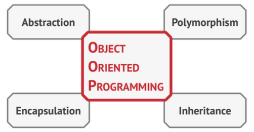
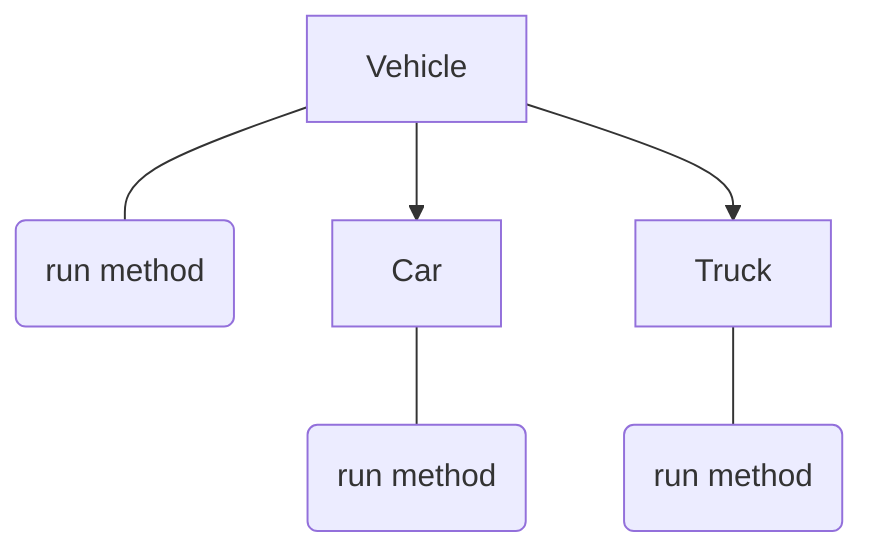

# Object Oriented Programming

[[toc]]

[toc]

## Basics of OOP

Object-oriented programming is a paradigm based on the con- cept of wrapping pieces of data, and behavior related to that data, into special bundles called objects, which are construct- ed from a set of _blueprints_, defined by a programmer, called _classes_.

### Objects, classes

> A class is like a blueprint that defines the structure for objects, which are concrete instances of that class.

```js
// In JS everything is an object. We can simulate simple OOP without using class keyword
function Book(title, author, year) {
	this.title = title;
	this.author = author;
	this.year = year;
}
// Or as a class
class Book {
	constructor(title, author) {
		this.title = title;
		this.author = author;
	}
	summary() {
		console.log(`${this.title} written by ${this.author}`);
	}
}
```

### Class Theory

"Class/Inheritance" describes a certain form of code organization and architecture -- a way of modeling real world problem domains in our software.

OOP or class oriented programming stresses that data intrinsically has associated behavior (of course, different depending on the type and nature of the data!) that operates on it, so proper design is to package up (aka, encapsulate) the data and the behavior together. This is sometimes called "data structures" in formal computer science.

**Another key concept with classes is "polymorphism", which describes the idea that a general behavior from a parent class can be overridden in a child class to give it more specifics.** In fact, relative polymorphism lets us reference the base behavior from the overridden behavior. Class theory strongly suggests that a parent class and a child class share the same method name for a certain behavior, so that the child overrides the parent (differentially).

#### Reference

-   [Class Theory](https://github.com/getify/You-Dont-Know-JS/blob/master/this%20%26%20object%20prototypes/ch4.md)

## Pillars of OOP

Object-oriented programming is based on four pillars, con- cepts that differentiate it from other programming paradigms.



### Encapsulation

**Encapsulation means hiding information or data.** It refers to the ability of the object to execute its functionality without revealing any execution details to the caller. In other words, the private variable is only visible to the current function and is not accessible to the global scope or other functions.

```js
const Book = function(t, a) {
   let title = t; // encapsulated, caller doesn't have access to this
   let author = a; // encapsulated

   return {
	   // Not encapsulated, this method is exposed to the caller of the Book
      summary : function() {
        console.log(`${title} written by ${author}.`);
      }
   }
}
const alch = new Book('Alchemist', 'Paulo Coelho');
alch.summary();
> Alchemist written by Paulo Coelho.
```

In the above code the title and the author are only visible inside the scope of the function Book and the method summary is visible to the caller of Book. So the title and the author are encapsulated inside Book.

To `encapsulate` something means to make it **private**, and thus accessible only from within the methods of it's own class.

If you want to change encapsulated state, you don't reach out and directly mutate some object's props. Instead, you call a method on the object, and _maybe_ the object will respond by updating its state. For example, if you build an application using Redux, instead of directly manipulating a view's data model, you dispatch a message called an action object to the data store. Redux controls the timing of when and how that message is handled. The timing and handling of that message are precisely controlled in order to create predictable, deterministic state updates. Given the same messages in the same order, Redux will always produce the same state.

> Same with React, we don't directly set React's component state; React does.

Encapsulation can be a powerful tool capable of helping you prevent bugs resulting from shared mutable state, and also for reducing tight coupling between components and the data structures they rely on. It helps you obey at least three key principles of software design:

-   **Avoid shared mutable state.** "Nondeterminism = parallel processing + mutable state" - Martin Odersky, designer of the Scala programming language
-   **"Program to an interface, not an implementation."** - Gang of Four, "Design Patterns: Elements of Reusable Object Oriented Software"
-   **"A small change in requirements should necessitate a correspondingly small change in the software."** - N. D. Birrell, M. A. Ould, "A Practical Handbook for Software Development"

#### Encapsulation in JavaScript

##### Using Closures

```js
const createCounter = () => {
	// A variable defined in a factory or constructor function scope
	// is private to that function.
	let count = 0;
	return {
		// Any other functions defined in the same scope are privileged:
		// These both have access to the private `count` variable
		// defined anywhere in their scope chain (containing function
		// scopes).
		click: () => (count += 1),
		getCount: () => count.toLocaleString(),
	};
};
const counter = createCounter();
counter.click();
counter.click();
counter.click();
console.log(counter.getCount());
```

##### Using Private Fields

```js
class Counter {
	#count = 0;

	click() {
		this.#count += 1;
	}
	getCount() {
		return this.#count.toLocaleString();
	}
}
const myCounter = new Counter();
myCounter.click();
myCounter.click();
myCounter.click();
console.log(myCounter.getCount());
```

#### Encapsulation References

-   [Encapsulation in JavaScript](https://medium.com/javascript-scene/encapsulation-in-javascript-26be60e325b4)

### Abstraction

**Abstraction means implementation hiding.** It is a way of hiding the implementation details and only showing the essential features to the caller. In other words, it hides irrelevant details and shows only what's necessary to the outer world.

```js
const Book = function (getTitle, getAuthor) {
	// Private variables / properties
	let title = getTitle;
	let author = getAuthor;

	// Private method
	const summary = function () {
		return `${title} written by ${author}.`;
	};
	// Public method
	this.giveTitle = function () {
		return title;
	};
	// Public method that has access to private method.
	this.giveSummary = function () {
		return summary();
	};
};
const alch = new Book('Alchemist', 'Paulo Coelho');
alch.giveTitle();
// "Alchemist"
alch.summary();
// Uncaught TypeError: alch.summary is not a function
alch.giveSummary();
// "Alchemist written by Paulo Coelho."
```

Abstraction is valuable for two key reasons:

-   Abstraction **hides certain details and only show the essential features of the object.** It tries to reduce and factor out details so that the developer can focus on a few concepts at a time. This approach improves understandability as well as maintainability of the code.
-   Abstraction helps us to **reduce code duplication**. Abstraction provides ways of dealing with crosscutting concerns and enables us to avoid tightly coupled code.

The lack of abstraction inevitably leads to problems with maintainability.

### Inheritance

Inheritance is the ability to build new classes on top of exist- ing ones. The main benefit of inheritance is code reuse. If you want to create a class that's slightly different from an existing one, there's no need to duplicate code. Instead, you extend the existing class and put the extra functionality into a resulting subclass, which inherits fields and methods of the superclass.

#### Example of prototypal inheritance in Js

```js
// Vehicle - superclass. Base object with common methods
function Vehicle(name) {
	this.name = name;
}
// superclass method
Vehicle.prototype.start = function () {
	return 'engine of ' + this.name + ' is starting...';
};

// Car - subclass
function Car(name) {
	Vehicle.call(this, name); // call super constructor.
}
// subclass extends superclass. Delegation link is created between sub-object and base object
Car.prototype = Object.create(Vehicle.prototype);
// subclass method - sub-object method
Car.prototype.run = function () {
	console.log('Hello, ' + this.start());
};

// instances of subclass. These instances  are pointing to subclass/sub-object via delegation
const volvo = new Car('Volvo');
const tesla = new Car('Tesla');
// accessing the subclass method which internally access superclass method
c1.run(); // "Hello, engine of Volvo is starting..."
c2.run(); // "Hello, engine of Tesla is starting..."
```

#### Inheritance resources

-   [MDN - Inheritance in JavaScript](https://developer.mozilla.org/en-US/docs/Learn/JavaScript/Objects/Inheritance)
-   [MDN - Inheritance and the prototype chain](https://developer.mozilla.org/en-US/docs/Web/JavaScript/Inheritance_and_the_prototype_chain)

### Polymorphism

> For the longest time, I thought that "Polymorphing" was about converting something into sheep (thanks to Warcraft). The sheep image stuck with me and made it hard to understand exactly what Polymorphism is.
>
> -   Zell Liew

I can relate so much to quote above :smile:

---

As object-oriented programming concepts revolve mainly around objects the objects can behave differently in different scenarios. **Polymorphism is nothing but one type but many forms.** One type of object can behave differently depending upon the runtime scenario. Polymorphism uses the concept of Inheritance to achieve this. In polymorphism, multiple objects will have the same method but different implementation and depending upon the user preference the corresponding object will be selected and the method corresponding to that object will be executed.



Polymorphism allows us to define the same method in different objects and provides the ability to call them depending upon the object. If we consider the above example, the method run() is common in both the child objects. The user can select an object of any of the child classes at runtime, the JavaScript will call then the run() method accordingly.

**There are three kinds of Polymorphism in programming:**

-   Adhoc Polymorphism
-   Parametric Polymorphism
-   Subtype Polymorphism

#### Adhoc polymorphism

Adhoc is used to describe creation of something without previous planning. In other words, Adhoc Polymorphism means to change something from one form to another on the spot.

There are a few forms of Adhoc Polymorphism:

-   Operator Overloading

For example `+` operator in JavaScript does many things. You can use it to add numbers. But you can also use it to concatenate strings. The _type_ of the result changes depending on what's being added.

-   Function Overloading

In some programming languages, Function overloading means creating two (or more) functions with the same name. Each function does something different depending on the arguments given to it.

Reference: [Wikipedia - Function overloading](https://en.wikipedia.org/wiki/Function_overloading)

Function Overloading in JavaScript is slightly different because we cannot produce two different functions with the same name. Still, we can use one function, but we change the results according to the arguments we receive.

```js
function volumeCuboid(length, breadth, height) {
	return length * breadth * height;
}

function volumeCube(length) {
	return volumeCubion(length, length, length);
}

// Overloading happens here
function calculateVolume(...args) {
	if (args.length === 3) return volumeCubiod(...args);
	return volumeCube(args[0]);
}
```

Another example: We can have a createShape function that returns different objects depending on value of shape. ([The Factory Pattern](../Books/Design_patterns.md#Factory-pattern) uses this type of Polymorphism).

```js
function createShape(size, shape) {
	if (shape === 'triangle') return new Triangle(/* ... */);
	if (shape === 'rectangle') return new Rectangle(/* ... */);
	if (shape === 'square') return new Square(/* ... */);
}
```

-   Coercion Polymorphism

JavaScript has Type coercion. It converts value from one type to another while evaluating them.

You can compare strings and numbers with `==` (although not recommended):

`22 == '22' // true`

Since type coercion happens on the spot, it is a form of adhoc polymorphism.`

#### Parametric polymorphism

Parametric Polymorphism has two parts:

-   Data that can contain many types of data

Everything in JavaScript is an Object. So Objects are parametric. It can be converted into other types of data.

Objects can also store multiple types. It doesn't care what values are stored.

```js
const obj = {
	str: 'hello',
	num: 123,
	bool: true,
};
```

Arrays are also parametric. It lets you store many types of data and it doesn't care what they are.

`const array = ['hello', 123, true]`

-   Functions that can work with many types of data

Functions that can work with many types of data are called polymorphic functions. They don't care what comes in. They'll apply the transformation they're told to do, and they spit out a result.

`map` is a good example. It takes in an array and spits out another array. It doesn't care what goes in-between.

```js
const doubled = [1, 2, 3].map((num) => num * 2);
const toString = [1, 2, 3].map((num) => `${num}`);
```

Object.assign is another example. It takes in an object and spits out another object, but it doesn't care what goes inside each object.

```js
Object.assign({}, { property: 'value' });
```

#### Subtype polymorphism

> This seems to be the only part of Polymorphism explained in OOP articles and tutorials.

Subtype Polymorphism involves creating derivative objects from a parent object. It's can be called Inclusion Polymorphism, Subclassing, or Inheritance. Derivatives objects can then override a method from the parent and it'll still work.

Example:

```js
class Human {
	constructor(name) {
		this.name = name;
	}

	sayHi() {
		console.log(`Hi! My name is ${name}`);
	}
}

class Developer extends Human {
	sayHi() {
		console.log(`Hi! My name is ${name}. I am a developer.`);
	}
}
class Designer extends Human {
	sayHi() {
		console.log(`Hi! My name is ${name}. I am a designer.`);
	}
}
// Now you have three different classes. Each one of them can sayHi.
// You can use sayHi normally and they'll all work, but they produce different results.
const zell = new Human('Zell');
const vincy = new Developer('Vincy');
const tim = new Designer('Tim');

zell.sayHi(); // Hi! My name is Zell.
vincy.sayHi(); // Hi! My name is Vincy. I am a developer.
zell.sayHi(); // Hi! My name is Tim. I am a designer.
```

#### Polymorphism references

-   [SO - What is polymorphism in Javascript?](https://stackoverflow.com/questions/27642239/what-is-polymorphism-in-javascript)
-   [On Understanding Types, Data Abstraction, and Polymorphism by Luca Cardelli](http://lucacardelli.name/Papers/OnUnderstanding.A4.pdf)
-   [Polymorphism in JavaScript](https://zellwk.com/blog/polymorphism-javascript/)

---

## References

-   [Head First Design Patterns - notes](../Books/Design_patterns.md)
-   [MDN](https://developer.mozilla.org/en-US/docs/Learn/JavaScript/Objects/Object-oriented_JS)
